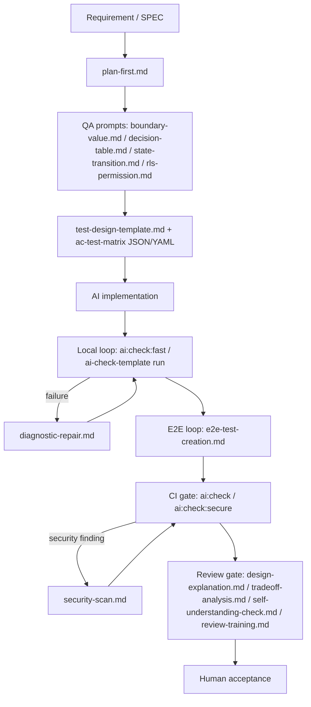

# Usage Model

`ai-check-template` is a post-implementation verification stack for AI-driven
development.

It does not make AI write code. It helps teams verify, repair, and safely accept
AI-generated code after implementation.

You do not need SAGE to use it. SAGE is only the governance system used to
maintain this repository; target projects can start with the CLI dry-run:

```sh
npx -y ai-check-template init --target . --profile react-nextjs --dry-run
```

```text
Requirement / SPEC
  -> AI implementation
  -> Local loop
  -> Repair loop
  -> E2E loop
  -> CI gate
  -> Review gate
  -> Human acceptance
```

First-look map:



The prompt catalog in [`../package-templates/prompts/README.md`](../package-templates/prompts/README.md) uses the same loop names.

## What This Solves

AI coding tools can produce implementation quickly. The slow part is proving
that the implementation is correct enough to merge.

This project standardizes the checks and prompts around that handoff:

| Loop | When to use it | What it gives you |
|---|---|---|
| Local loop | Immediately after AI edits | Fast feedback from typecheck, lint, unit, and diagnostics |
| Repair loop | When checks fail | Structured evidence for AI-assisted repair |
| E2E loop | For critical user journeys | Stable Playwright tests and failure artifacts |
| CI gate | On pull requests and main | The same quality gate for every contributor |
| Review gate | Before human acceptance | Design, alternatives, risks, and added tests made explicit |

## Local Loop

The local loop is the first filter after AI implementation.

Typical commands:

```sh
pnpm ai:check:fast
pnpm ai:check
pnpm ai:check:secure
npx -y ai-check-template run --target . --script ai:check --json
npx -y ai-check-template expect --file docs/ai-check-template/docs/ac-test-matrix.example.json --json
```

Use `ai:check:fast` for frequent feedback. It should stay cheap enough to run
after small edits. Use `ai:check` before opening or updating a pull request.
Use `ai:check:secure` when security evidence is needed; it is intentionally
separate from the functional quality gate.

This loop catches:

- type errors
- lint failures
- missing or failing tests
- dead exports and unused dependencies
- obvious React / UI diagnostic issues when the selected profile supports them

Security findings should be collected through the separate `ai:check:secure`
gate. The generated default chain covers `security:secrets`, `security:deps`,
`security:supply-chain`, and `security:sast` (`semgrep scan --config auto`).
Installing scanners and tuning project-specific rules remain the target
project's responsibility.

## Repair Loop

The repair loop turns failures into useful input for an AI agent.

Instead of saying "fix the bug", the workflow should provide:

- the failed command
- the relevant output
- the expected behavior
- the files that are in scope
- the checks that must be rerun

The [`diagnostic-repair.md`](../package-templates/prompts/diagnostic-repair.md)
prompt exists for this step. The goal is to keep the agent grounded in evidence
instead of allowing it to self-report success.

For command evidence, prefer `ai-check-template run --json --output .ai-check/ai-check-result.json`.
It records each command step with `PASS`, `FAIL`, or `SKIPPED`, duration, and
redacted stdout/stderr so the repair prompt can receive precise evidence.

Security findings use a separate prompt:
[`security-scan.md`](../package-templates/prompts/security-scan.md). Run
`ai:check:secure` separately from `ai:check`, redact scanner output, and ask the
agent to classify each finding as fix, false positive, suppression, accepted
risk, or human review. This keeps security decisions out of the normal feature
repair loop.

## E2E Loop

The E2E loop protects critical user journeys with Playwright.

Use it for flows where a unit test is not enough:

- login and auth redirects
- search and filtering
- save / apply / checkout style conversion paths
- permission boundaries
- mobile viewport smoke checks

Stable E2E tests need rules. Prefer user-facing locators such as role and label
selectors, keep setup deterministic, and preserve trace artifacts when CI fails.

The package includes manual-copy templates for this loop:

- [`package-templates/playwright/README.md`](../package-templates/playwright/README.md)
- [`package-templates/playwright/playwright.config.ts`](../package-templates/playwright/playwright.config.ts)
- [`package-templates/playwright/tests/smoke.spec.ts`](../package-templates/playwright/tests/smoke.spec.ts)
- [`e2e-test-creation.md`](../package-templates/prompts/e2e-test-creation.md)

This loop is also where AI can help generate tests from natural-language flows,
but generated tests still need review for selector quality and flaky behavior.

## CI Gate

The CI gate makes local expectations enforceable for the team.

Projects can copy workflow examples or call the hosted reusable workflow:

```yaml
jobs:
  ai-quality:
    uses: heidayo/ai-check-template/.github/workflows/ai-quality.yml@v0.3.0
    with:
      package-manager: pnpm
      check-command: pnpm ai:check
```

The hosted workflow and Composite Action are documented in
[`github-actions.md`](./github-actions.md).

The CI gate is not a replacement for local checks. It is the shared backstop
that prevents "works on my machine" from becoming the merge standard.

## Review Gate

The review gate is the human acceptance step.

AI-generated code should not be accepted only because checks pass. The author or
agent should be able to explain:

- the design that was chosen
- alternatives that were considered
- known risks or tradeoffs
- tests that were added or updated
- which checks were run and what evidence they produced

This matters because AI can produce code that works locally while still being
hard to maintain, unsafe at trust boundaries, or poorly understood by the team.

The package includes templates for this gate. Use `init --review-templates` to
install them with the CLI, let `doctor` / `update` track them through install
state, or copy them manually when you need custom placement:

- [`package-templates/.github/PULL_REQUEST_TEMPLATE.md`](../package-templates/.github/PULL_REQUEST_TEMPLATE.md)
- [`package-templates/worksheet/ai-code-understanding.md`](../package-templates/worksheet/ai-code-understanding.md)
- [`design-explanation.md`](../package-templates/prompts/design-explanation.md)
- [`tradeoff-analysis.md`](../package-templates/prompts/tradeoff-analysis.md)
- [`self-understanding-check.md`](../package-templates/prompts/self-understanding-check.md)
- [`review-training.md`](../package-templates/prompts/review-training.md)

These templates do not replace reviewer judgment. They make the author's design
claim, evidence, and uncertainty visible enough for a human to challenge.

## What To Use First

Start small:

1. Install a profile with the CLI or copy the relevant templates.
2. Add `ai:check:fast` and `ai:check` to the target project.
3. Add one critical Playwright smoke test.
4. Run the GitHub Actions quality gate on pull requests.
5. Enable `--review-templates` or copy the reviewability PR template / worksheet, then require authors to record design, risks, and added tests.

Do not start with a perfect QA platform. Start with one important flow and make
the verification loop repeatable.

## Follow-Up Tracks

These are planned directions, not all shipped behavior in the current package:

| Track | Purpose |
|---|---|
| Security automation | Shipped split scripts for secret scan, dependency audit, supply-chain, and Semgrep SAST under `ai:check:secure` |
| Reviewability automation | Shipped optional CLI install / update / doctor support for reviewability templates |
| Playwright stabilization | Shipped manual-copy config examples, locator rules, artifact guidance, and E2E creation prompt |
| Profile corrections | Revisit profile assumptions as external tools evolve |
| Marketplace / major alias | Promote GitHub Actions integration after more dogfooding |

Each track should be implemented through its own SPEC so the package stays
incremental and easy to adopt.
