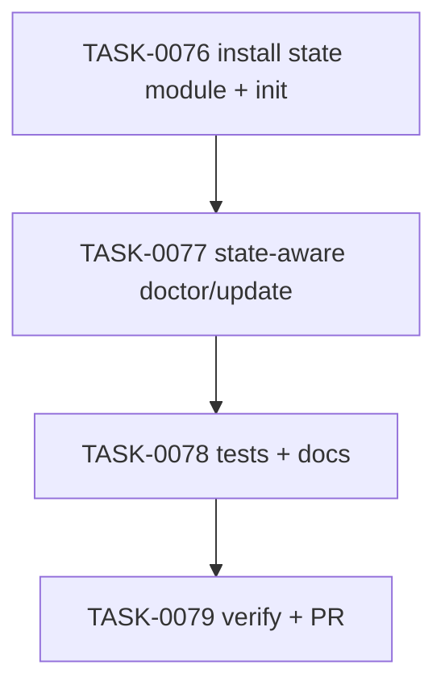

# PLAN-0020: CLI profile state foundation

## メタデータ

| フィールド | 内容 |
|-----------|------|
| PLAN-ID   | PLAN-0020 |
| SPEC-ID   | SPEC-0020 |
| ステータス | Completed |
| 作成日    | 2026-05-14 |
| 担当Agent | Planning Agent |

## 変更レイヤ

- [x] controller
- [x] usecase
- [x] domain
- [x] infrastructure
- [ ] frontend
- [ ] infra
- [x] test
- [x] docs

## 影響範囲

- CLI controller: `init`, `doctor`, `update` の argument resolution と output schema
- CLI domain: install state schema v1 と profile / CI / Claude hooks option precedence
- CLI infrastructure: target root `.ai-check-template.json` read / write
- Tests: CLI fixture tests and npm pack contents check
- Docs: README / README-ja / CLI docs / roadmap

## 実装方針

`src/cli/install-state.mjs` を追加し、state schema build / parse / read / write / effective option resolution を集約する。`init` は parse 済み profile と selected flags から deterministic state を write する。`doctor` / `update` は command-specific parser で explicit flag presence を保持し、state が存在する場合は explicit flags > state > legacy defaults の順で effective options を決める。

`doctor` は read-only を維持し、state parse failure を issue として output する。`update` は write command のため、state parse failure を write 前に reject する。`--dry-run` は state refresh operation を output に含めるが、state file も含めて target を変更しない。

## タスク分解

| TASK-ID | 責務 | 担当Agent | 見積 | 依存TASK | 並列可否 |
|---------|------|----------|------|---------|---------|
| TASK-0076 | install state module と init state write | Implementation | 45m | none | Yes |
| TASK-0077 | doctor / update の state-aware defaults と JSON output | Implementation | 55m | TASK-0076 | No |
| TASK-0078 | CLI tests / package test / docs / roadmap 更新 | Test+Docs | 45m | TASK-0076, TASK-0077 | No |
| TASK-0079 | AC 検証、採点、SAGE status 更新、commit / PR | Verify | 35m | TASK-0076, TASK-0077, TASK-0078 | No |

## 依存グラフ

## File Scope by Task

| TASK-ID | 変更許可ファイル |
|---|---|
| TASK-0076 | `src/cli/install-state.mjs`, `src/cli/init.mjs` |
| TASK-0077 | `src/cli/doctor.mjs`, `src/cli/update.mjs` |
| TASK-0078 | `tests/cli/init.test.mjs`, `tests/cli/doctor.test.mjs`, `tests/cli/update.test.mjs`, `tests/cli/package.test.mjs`, `docs/cli.md`, `README.md`, `README-ja.md`, `docs/roadmap.md` |
| TASK-0079 | `specs/SPEC-0020-cli-profile-state.md`, `plans/PLAN-0020-cli-profile-state.md`, `tasks/TASK-0076-install-state-init.md`, `tasks/TASK-0077-state-aware-doctor-update.md`, `tasks/TASK-0078-profile-state-tests-docs.md`, `tasks/TASK-0079-verify-cli-profile-state.md` |

## リスク

- stale state が explicit user intent と衝突する → explicit flags override を優先し、tests で precedence を固定する
- malformed state で `update` が write してしまう → state read を write operation より前に行い、failure test を追加する
- JSON output schema が既存利用者を壊す → existing fields `status`, `target`, `issues` / `operations` は維持し、new fields は additive にする
- scope creep で profile-specific migration まで入る → this plan は state foundation のみ、`package-templates/**` 変更禁止

## 必要な検証

- [x] unit test: `node --test tests/cli/*.test.mjs`
- [x] integration test: init → doctor → update fixture scenarios
- [x] security scan: secret-like literal grep and dry-run snapshot
- [ ] e2e test: actual npm publish / npx execution is out of scope
- [x] architecture boundary check: File Scope / protected file / `package-templates/**` unchanged
- [x] release packaging check: `npm pack --dry-run --json`

## Error Resolution

| 失敗 | 復旧手順 |
|---|---|
| state JSON invalid | `install-state.mjs` schema builder / `writeJson` call を修正 |
| doctor ignores state | option parser の explicit flag tracking と resolver を修正 |
| update writes on malformed state | update state read order と guard を修正 |
| dry-run writes state | state write function の `dryRun` handling と snapshot test を修正 |
| package tarball missing module | `tests/cli/package.test.mjs` requiredFiles を修正 |

## Knowledge Management

profile state failure が発生した場合、maintainer が command、state JSON、effective options、expected vs actual を `sage/failures.md` に記録する。同種の malformed state write bug が 3 回発生した場合、`sage/anti-patterns.md` への昇格候補にする。

## 採点

- PLAN-0020: 100/S++（6軸: Codified Rules 20 / Atomic Decomposition 20 / Spec-Driven 20 / Observable 20 / Knowledge 15 / Gradual Adoption 5）
- TASK-0076: 100/S++
- TASK-0077: 100/S++
- TASK-0078: 100/S++
- TASK-0079: 100/S++
