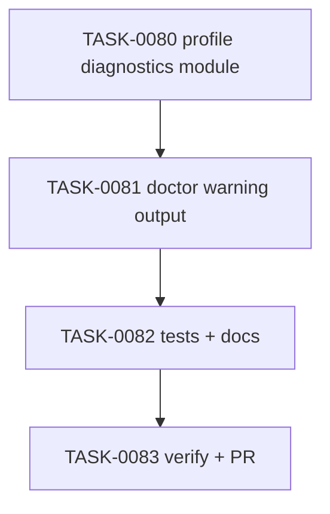

# PLAN-0021: CLI profile diagnostics foundation

## メタデータ

| フィールド | 内容 |
|-----------|------|
| PLAN-ID   | PLAN-0021 |
| SPEC-ID   | SPEC-0021 |
| ステータス | Completed |
| 作成日    | 2026-05-14 |
| 担当Agent | Planning Agent |

## 変更レイヤ

- [x] controller
- [x] usecase
- [x] domain
- [ ] infrastructure
- [ ] frontend
- [ ] infra
- [x] test
- [x] docs

## 影響範囲

- CLI controller: `doctor` output schema and human output
- CLI domain: profile advisory rules based on effective profile and package scripts
- Tests: doctor warning scenarios and npm pack contents check
- Docs: README / README-ja / CLI docs / roadmap

## 実装方針

`src/cli/profile-diagnostics.mjs` を追加し、profile advisory rules を `doctor` から分離する。`doctor` は `package.json` を読み、既存 `issues` の生成後に package scripts と effective profile を diagnostics module に渡して `warnings` を得る。

warnings は non-blocking とし、`status` は従来どおり `issues.length === 0 ? "pass" : "fail"` で決める。JSON output は additive に `warnings` を追加し、human output では warnings count と details を表示する。

## タスク分解

| TASK-ID | 責務 | 担当Agent | 見積 | 依存TASK | 並列可否 |
|---------|------|----------|------|---------|---------|
| TASK-0080 | profile diagnostics module | Implementation | 35m | none | Yes |
| TASK-0081 | doctor warning output integration | Implementation | 40m | TASK-0080 | No |
| TASK-0082 | tests / docs / package check | Test+Docs | 45m | TASK-0080, TASK-0081 | No |
| TASK-0083 | AC 検証、採点、SAGE status 更新、commit / PR | Verify | 35m | TASK-0080, TASK-0081, TASK-0082 | No |

## 依存グラフ

## File Scope by Task

| TASK-ID | 変更許可ファイル |
|---|---|
| TASK-0080 | `src/cli/profile-diagnostics.mjs` |
| TASK-0081 | `src/cli/doctor.mjs` |
| TASK-0082 | `tests/cli/doctor.test.mjs`, `tests/cli/package.test.mjs`, `docs/cli.md`, `README.md`, `README-ja.md`, `docs/roadmap.md` |
| TASK-0083 | `specs/SPEC-0021-cli-profile-diagnostics.md`, `plans/PLAN-0021-cli-profile-diagnostics.md`, `tasks/TASK-0080-profile-diagnostics-module.md`, `tasks/TASK-0081-doctor-warning-output.md`, `tasks/TASK-0082-profile-diagnostics-tests-docs.md`, `tasks/TASK-0083-verify-cli-profile-diagnostics.md` |

## リスク

- warning が noisy になる → non-blocking advisory として出し、strict mode は scope 外
- warning が secret / command full text を漏らす → script name と generic message のみに限定し test で固定
- existing JSON consumers を壊す → existing fields を維持し additive field のみ追加
- profile docs と rule がずれる → rule comments は docs ではなく profile name / script shape に限定し、docs 更新で同期

## 必要な検証

- [x] unit test: `node --test tests/cli/doctor.test.mjs`
- [x] integration test: init → doctor warning scenarios
- [x] security scan: warning output does not include full command / secret-like literal
- [ ] e2e test: actual npm publish / npx execution is out of scope
- [x] architecture boundary check: File Scope / protected file / `package-templates/**` unchanged
- [x] release packaging check: `npm pack --dry-run --json`

## Error Resolution

| 失敗 | 復旧手順 |
|---|---|
| warnings fail doctor | status calculation を `issues` のみに戻す |
| JSON output missing warnings | output builder に `warnings` を追加 |
| command leaked | warning message builder から command interpolation を削除 |
| package tarball missing module | `tests/cli/package.test.mjs` requiredFiles を修正 |

## Knowledge Management

profile warning false positive / false negative が発生した場合、maintainer が profile, package scripts shape, expected warning, actual output を `sage/failures.md` に記録する。同種 regression が 3 回発生した場合、`sage/anti-patterns.md` への昇格候補にする。

## 採点

- PLAN-0021: 100/S++（6軸: Codified Rules 20 / Atomic Decomposition 20 / Spec-Driven 20 / Observable 20 / Knowledge 15 / Gradual Adoption 5）
- TASK-0080: 100/S++
- TASK-0081: 100/S++
- TASK-0082: 100/S++
- TASK-0083: 100/S++
