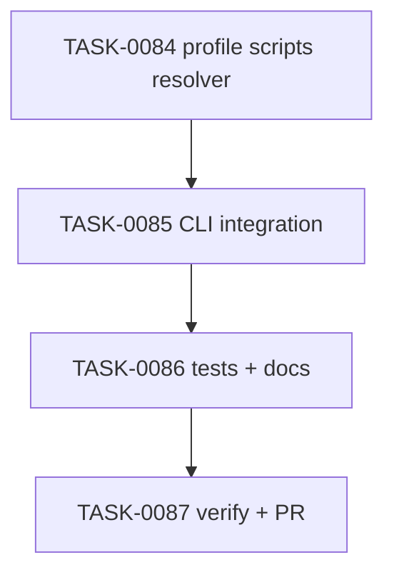

# PLAN-0022: CLI profile script migrations

## メタデータ

| フィールド | 内容 |
|-----------|------|
| PLAN-ID   | PLAN-0022 |
| SPEC-ID   | SPEC-0022 |
| ステータス | Completed |
| 作成日    | 2026-05-14 |
| 担当Agent | Planning Agent |

## 変更レイヤ

- [x] controller
- [x] usecase
- [x] domain
- [ ] infrastructure
- [ ] frontend
- [ ] infra
- [x] test
- [x] docs

## 影響範囲

- CLI domain: profile-aware expected package scripts
- CLI controller/usecase: `init`, `doctor`, `update` package script merge / check / migration paths
- Tests: init / doctor / update / package tests
- Docs: README / README-ja / CLI docs / roadmap

## 実装方針

`src/cli/profile-scripts.mjs` を追加し、effective profile から deterministic scripts object を返す。`init` は selected profile を resolver に渡し、existing script skip / `--overwrite` behavior を維持したまま merge する。`doctor` と `update` は effective profile を resolver に渡し、generic fragment ではなく profile-aware expected scripts で比較・更新する。

`package-templates/package.scripts.fragment.json` は copy-and-adapt 用の generic fragment として維持し、CLI alpha の profile-aware behavior は docs に明記する。

## タスク分解

| TASK-ID | 責務 | 担当Agent | 見積 | 依存TASK | 並列可否 |
|---------|------|----------|------|---------|---------|
| TASK-0084 | profile scripts resolver | Implementation | 35m | none | Yes |
| TASK-0085 | init / doctor / update integration | Implementation | 50m | TASK-0084 | No |
| TASK-0086 | tests / docs / package check | Test+Docs | 50m | TASK-0084, TASK-0085 | No |
| TASK-0087 | AC 検証、採点、SAGE status 更新、commit / PR | Verify | 35m | TASK-0084, TASK-0085, TASK-0086 | No |

## 依存グラフ

## File Scope by Task

| TASK-ID | 変更許可ファイル |
|---|---|
| TASK-0084 | `src/cli/profile-scripts.mjs` |
| TASK-0085 | `src/cli/init.mjs`, `src/cli/doctor.mjs`, `src/cli/update.mjs` |
| TASK-0086 | `tests/cli/init.test.mjs`, `tests/cli/doctor.test.mjs`, `tests/cli/update.test.mjs`, `tests/cli/package.test.mjs`, `docs/cli.md`, `README.md`, `README-ja.md`, `docs/roadmap.md` |
| TASK-0087 | `specs/SPEC-0022-cli-profile-script-migrations.md`, `plans/PLAN-0022-cli-profile-script-migrations.md`, `tasks/TASK-0084-profile-scripts-resolver.md`, `tasks/TASK-0085-profile-script-cli-integration.md`, `tasks/TASK-0086-profile-script-tests-docs.md`, `tasks/TASK-0087-verify-cli-profile-script-migrations.md` |

## リスク

- profile scripts が existing custom scripts を壊す → `init` skip semantics と `update --dry-run` / `--yes` guard を維持する
- generic package fragment と CLI resolver の差分が混乱を生む → docs に manual fragment と CLI alpha resolver の役割差を明記する
- helper scripts が tool installation 前に failing command になる → alpha defaults として docs に明記し、dependency install / package manager detection は scope 外にする

## 必要な検証

- [x] unit test: `node --test tests/cli/*.test.mjs`
- [x] integration test: init → doctor → update profile migration scenarios
- [x] security scan: secret-like literal grep and dry-run snapshot
- [ ] e2e test: actual npm publish / npx execution is out of scope
- [x] architecture boundary check: File Scope / protected file / `package-templates/**` unchanged
- [x] release packaging check: `npm pack --dry-run --json`

## Error Resolution

| 失敗 | 復旧手順 |
|---|---|
| node-cli still includes E2E | `profile-scripts.mjs` node-cli base scripts を修正 |
| supabase scripts missing | addon merge logic を修正 |
| doctor compares generic scripts | `doctor` expected scripts path を resolver に変更 |
| update dry-run writes | update package script write guard を修正 |
| package tarball missing module | `tests/cli/package.test.mjs` requiredFiles を修正 |

## Knowledge Management

profile script migration failure が発生した場合、maintainer が profile, before scripts, expected scripts, actual output を `sage/failures.md` に記録する。同種 wrong-profile migration が 3 回発生した場合、`sage/anti-patterns.md` への昇格候補にする。

## 採点

- PLAN-0022: 100/S++（6軸: Codified Rules 20 / Atomic Decomposition 20 / Spec-Driven 20 / Observable 20 / Knowledge 15 / Gradual Adoption 5）
- TASK-0084: 100/S++
- TASK-0085: 100/S++
- TASK-0086: 100/S++
- TASK-0087: 100/S++
