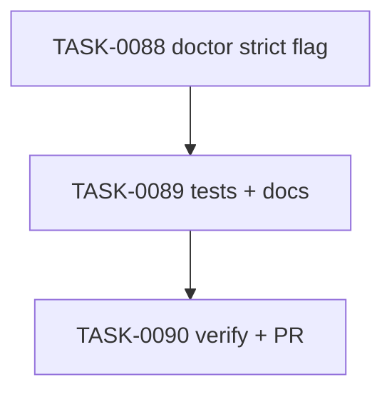

# PLAN-0023: CLI doctor strict warnings

## メタデータ

| フィールド | 内容 |
|-----------|------|
| PLAN-ID   | PLAN-0023 |
| SPEC-ID   | SPEC-0023 |
| ステータス | Completed |
| 作成日    | 2026-05-14 |
| 担当Agent | Planning Agent |

## 変更レイヤ

- [x] controller
- [x] usecase
- [ ] domain
- [ ] infrastructure
- [ ] frontend
- [ ] infra
- [x] test
- [x] docs

## 影響範囲

- CLI controller: `doctor` argument parsing, command usage text, and top-level help
- CLI usecase: doctor output status calculation and error path
- Tests: strict / default warning behavior and read-only snapshot
- Docs: README / README-ja / CLI docs / roadmap

## 実装方針

`src/cli/doctor.mjs` に `--strict` boolean を追加し、output に `strict` を additive field として含める。`src/cli/index.mjs` の top-level help にも doctor strict option を反映する。status は `issues.length > 0 || (options.strict && warnings.length > 0)` で判定し、warnings array と issues array は分離したまま維持する。

default behavior は既存互換として warnings-only なら exit 0 のままにする。strict mode は opt-in として docs に明記する。

## タスク分解

| TASK-ID | 責務 | 担当Agent | 見積 | 依存TASK | 並列可否 |
|---------|------|----------|------|---------|---------|
| TASK-0088 | doctor strict flag implementation | Implementation | 35m | none | Yes |
| TASK-0089 | strict tests and docs | Test+Docs | 40m | TASK-0088 | No |
| TASK-0090 | AC 検証、採点、SAGE status 更新、commit / PR | Verify | 35m | TASK-0088, TASK-0089 | No |

## 依存グラフ

## File Scope by Task

| TASK-ID | 変更許可ファイル |
|---|---|
| TASK-0088 | `src/cli/doctor.mjs`, `src/cli/index.mjs` |
| TASK-0089 | `tests/cli/doctor.test.mjs`, `docs/cli.md`, `README.md`, `README-ja.md`, `docs/roadmap.md` |
| TASK-0090 | `specs/SPEC-0023-cli-doctor-strict-warnings.md`, `plans/PLAN-0023-cli-doctor-strict-warnings.md`, `tasks/TASK-0088-doctor-strict-flag.md`, `tasks/TASK-0089-doctor-strict-tests-docs.md`, `tasks/TASK-0090-verify-cli-doctor-strict-warnings.md` |

## リスク

- default warning behavior regression → explicit default-mode test を維持する
- warnings が issues に変換される → JSON shape test で warnings / issues separation を固定する
- strict mode が target に書く → snapshot test で read-only を確認する

## 必要な検証

- [x] unit test: `node --test tests/cli/doctor.test.mjs`
- [x] integration test: init → warning-only doctor default / strict scenarios
- [x] security scan: secret-like literal grep and read-only snapshot
- [x] e2e test: actual npm publish / npx execution is out of scope (SKIPPED by scope)
- [x] architecture boundary check: File Scope / protected file / `package-templates/**` unchanged

## Error Resolution

| 失敗 | 復旧手順 |
|---|---|
| default warnings fail | status calculation の strict condition を修正 |
| strict warnings pass | strict branch に warnings count を含める |
| JSON missing strict | output builder に `strict` を追加 |
| snapshot changed | doctor path から write operation を削除 |

## Knowledge Management

strict warning regression が発生した場合、maintainer が command, warnings, expected status, actual output を `sage/failures.md` に記録する。同種 default-mode regression が 3 回発生した場合、`sage/anti-patterns.md` への昇格候補にする。

## 採点

- SPEC-0023: 100/S++（6軸: Codified Rules 20 / Atomic Decomposition 20 / Spec-Driven 20 / Observable 20 / Knowledge 15 / Gradual Adoption 5）
- PLAN-0023: 100/S++（6軸: Codified Rules 20 / Atomic Decomposition 20 / Spec-Driven 20 / Observable 20 / Knowledge 15 / Gradual Adoption 5）
- TASK-0088: 100/S++
- TASK-0089: 100/S++
- TASK-0090: 100/S++
