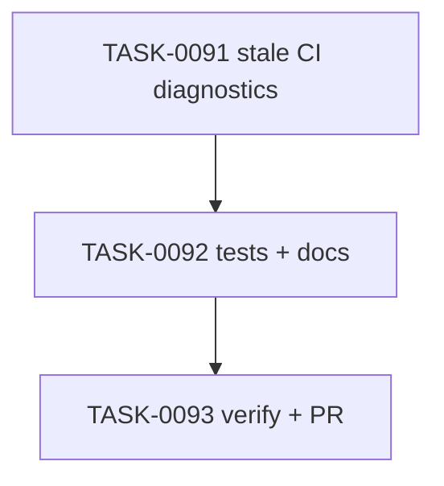

# PLAN-0024: CLI stale CI diagnostics

## メタデータ

| フィールド | 内容 |
|-----------|------|
| PLAN-ID   | PLAN-0024 |
| SPEC-ID   | SPEC-0024 |
| ステータス | Completed |
| 作成日    | 2026-05-14 |
| 担当Agent | Planning Agent |

## 変更レイヤ

- [x] controller
- [x] usecase
- [ ] domain
- [ ] infrastructure
- [ ] frontend
- [x] infra
- [x] test
- [x] docs

## 影響範囲

- CLI usecase: doctor inactive CI workflow warning calculation
- CLI output: additional `warnings[]` entries with `code: "ci-advice"`
- Tests: stale managed CI warnings, strict integration, custom workflow false-positive guard
- Docs: README / README-ja / CLI docs / roadmap

## 実装方針

`src/cli/doctor.mjs` に inactive CI workflow scanner を追加する。selected CI mode の expected files は従来どおり `issues` として検査し、その後に inactive mode の known workflow paths を read-only で確認する。

warning は target file contents が packaged template と完全一致する場合だけ出す。これにより、ユーザーが同名 workflow を編集しているケースは custom workflow とみなし、stale managed warning を避ける。

## タスク分解

| TASK-ID | 責務 | 担当Agent | 見積 | 依存TASK | 並列可否 |
|---------|------|----------|------|---------|---------|
| TASK-0091 | stale CI warning implementation | Implementation | 35m | none | Yes |
| TASK-0092 | stale CI tests and docs | Test+Docs | 40m | TASK-0091 | No |
| TASK-0093 | AC 検証、採点、SAGE status 更新、commit / PR | Verify | 35m | TASK-0091, TASK-0092 | No |

## 依存グラフ

## File Scope by Task

| TASK-ID | 変更許可ファイル |
|---|---|
| TASK-0091 | `src/cli/doctor.mjs` |
| TASK-0092 | `tests/cli/doctor.test.mjs`, `docs/cli.md`, `README.md`, `README-ja.md`, `docs/roadmap.md` |
| TASK-0093 | `specs/SPEC-0024-cli-stale-ci-diagnostics.md`, `plans/PLAN-0024-cli-stale-ci-diagnostics.md`, `tasks/TASK-0091-stale-ci-diagnostics.md`, `tasks/TASK-0092-stale-ci-tests-docs.md`, `tasks/TASK-0093-verify-stale-ci-diagnostics.md` |

## リスク

- custom workflow false positive → exact template match だけ warning にする
- selected CI missing / drift regression → existing selected-mode issue tests を維持する
- strict default regression → SPEC-0023 default warning behavior tests を維持する

## 必要な検証

- [x] unit test: `node --test tests/cli/doctor.test.mjs`
- [x] integration test: init direct → `doctor --ci none` default / strict scenarios
- [x] security scan: secret-like literal grep and read-only snapshot
- [x] e2e test: actual npm publish / npx execution is out of scope (SKIPPED by scope)
- [x] architecture boundary check: File Scope / protected file / `package-templates/**` unchanged

## Error Resolution

| 失敗 | 復旧手順 |
|---|---|
| stale managed file missing warning | inactive CI file list and exact match helper を修正 |
| custom workflow false warning | exact template match 判定を強化 |
| selected CI issues disappear | selected mode `checkCi` path を warnings path と分離 |
| strict stale warning pass | SPEC-0023 strict status calculation と warnings merge を確認 |

## Knowledge Management

stale CI diagnostics の false positive / false negative が発生した場合、maintainer が command, ci mode, workflow path, expected warning, actual output を `sage/failures.md` に記録する。同種 cleanup request が 3 回発生した場合、workflow cleanup SPEC または `sage/anti-patterns.md` への昇格候補にする。

## 採点

- SPEC-0024: 100/S++（6軸: Codified Rules 20 / Atomic Decomposition 20 / Spec-Driven 20 / Observable 20 / Knowledge 15 / Gradual Adoption 5）
- PLAN-0024: 100/S++（6軸: Codified Rules 20 / Atomic Decomposition 20 / Spec-Driven 20 / Observable 20 / Knowledge 15 / Gradual Adoption 5）
- TASK-0091: 100/S++
- TASK-0092: 100/S++
- TASK-0093: 100/S++
