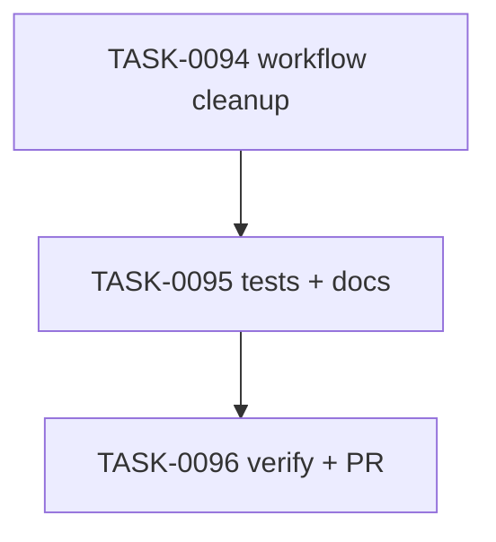

# PLAN-0025: CLI managed workflow cleanup

## メタデータ

| フィールド | 内容 |
|-----------|------|
| PLAN-ID   | PLAN-0025 |
| SPEC-ID   | SPEC-0025 |
| ステータス | Completed |
| 作成日    | 2026-05-14 |
| 担当Agent | Planning Agent |

## 変更レイヤ

- [x] controller
- [x] usecase
- [ ] domain
- [ ] infrastructure
- [ ] frontend
- [x] infra
- [x] test
- [x] docs

## 影響範囲

- CLI usecase: update inactive exact-managed CI workflow cleanup
- CLI output: additional `operations[]` entries with `would-delete`, `delete`, or `keep`
- Tests: dry-run safety, exact-managed deletion, custom workflow preservation, doctor post-check
- Docs: README / README-ja / CLI docs / roadmap

## 実装方針

`src/cli/update.mjs` の selected CI workflow update 後に inactive CI workflow cleanup を追加する。cleanup 対象は selected mode ではない known workflow paths のうち、target file contents が packaged template と完全一致するものだけに限定する。

`--dry-run` では `would-delete` operation を出し、target file は変更しない。custom workflow は `keep` operation として報告し、削除しない。write は既存の `--yes` confirmation guard に従う。

## タスク分解

| TASK-ID | 責務 | 担当Agent | 見積 | 依存TASK | 並列可否 |
|---------|------|----------|------|---------|---------|
| TASK-0094 | managed workflow cleanup implementation | Implementation | 35m | none | Yes |
| TASK-0095 | cleanup tests and docs | Test+Docs | 40m | TASK-0094 | No |
| TASK-0096 | AC 検証、採点、SAGE status 更新、commit / PR | Verify | 35m | TASK-0094, TASK-0095 | No |

## 依存グラフ

## File Scope by Task

| TASK-ID | 変更許可ファイル |
|---|---|
| TASK-0094 | `src/cli/update.mjs` |
| TASK-0095 | `tests/cli/update.test.mjs`, `docs/cli.md`, `README.md`, `README-ja.md`, `docs/roadmap.md` |
| TASK-0096 | `specs/SPEC-0025-cli-managed-workflow-cleanup.md`, `plans/PLAN-0025-cli-managed-workflow-cleanup.md`, `tasks/TASK-0094-managed-workflow-cleanup.md`, `tasks/TASK-0095-managed-workflow-cleanup-tests-docs.md`, `tasks/TASK-0096-verify-managed-workflow-cleanup.md` |

## リスク

- custom workflow accidental cleanup → exact template match だけ削除する
- dry-run write regression → snapshot test を追加する
- selected CI workflow removal → inactive mode list と selected mode update を分離する

## 必要な検証

- [x] unit test: `node --test tests/cli/update.test.mjs`
- [x] integration test: init direct → update none / reusable scenarios
- [x] security scan: secret-like literal grep and custom workflow preservation
- [x] e2e test: actual npm publish / npx execution is out of scope (SKIPPED by scope)
- [x] architecture boundary check: File Scope / protected file / `package-templates/**` unchanged

## Error Resolution

| 失敗 | 復旧手順 |
|---|---|
| exact-managed cleanup missing | inactive CI file list and exact match helper を修正 |
| custom workflow removed | exact match helper と custom preservation test を修正 |
| dry-run writes | dry-run branch で unlink を呼ばない |
| doctor still warns after update | cleanup order と install state write を確認 |

## Knowledge Management

managed workflow cleanup の false positive / false negative が発生した場合、maintainer が command, ci mode, workflow path, expected operation, actual output を `sage/failures.md` に記録する。同種 package script cleanup request が 3 回発生した場合、follow-up SPEC または `sage/anti-patterns.md` への昇格候補にする。

## 採点

- SPEC-0025: 100/S++（6軸: Codified Rules 20 / Atomic Decomposition 20 / Spec-Driven 20 / Observable 20 / Knowledge 15 / Gradual Adoption 5）
- PLAN-0025: 100/S++（6軸: Codified Rules 20 / Atomic Decomposition 20 / Spec-Driven 20 / Observable 20 / Knowledge 15 / Gradual Adoption 5）
- TASK-0094: 100/S++
- TASK-0095: 100/S++
- TASK-0096: 100/S++
