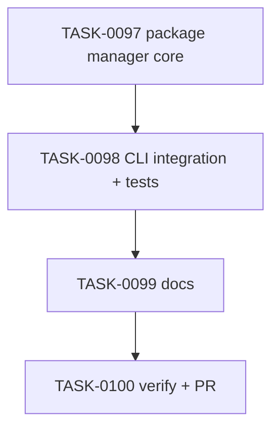

# PLAN-0026: CLI package manager detection

## メタデータ

| フィールド | 内容 |
|-----------|------|
| PLAN-ID   | PLAN-0026 |
| SPEC-ID   | SPEC-0026 |
| ステータス | Completed |
| 作成日    | 2026-05-14 |
| 担当Agent | Planning Agent |

## 変更レイヤ

- [x] controller
- [x] usecase
- [x] domain
- [ ] infrastructure
- [ ] frontend
- [ ] infra
- [x] test
- [x] docs

## 影響範囲

- CLI domain: package manager detector and script invocation rendering
- CLI usecase: init / doctor / update effective options and install state
- CLI controller: `--package-manager` parse and help text
- Tests: init / doctor / update / package smoke expectations
- Docs: README / README-ja / CLI docs / roadmap

## 実装方針

`src/cli/package-manager.mjs` を追加し、explicit package manager validation、target detection、script invocation rendering を閉じ込める。`profile-scripts` は package manager を受け取り、profile-specific commands の script invocation 部分を `pnpm` / `npm` / `yarn` / `bun` に合わせる。

install state は `packageManager` を additive field として保存し、既存 state に field がない場合は `pnpm` として扱う。effective options priority は explicit flag → install state → detection → `pnpm` default にする。

## タスク分解

| TASK-ID | 責務 | 担当Agent | 見積 | 依存TASK | 並列可否 |
|---------|------|----------|------|---------|---------|
| TASK-0097 | package manager core and install state | Implementation | 45m | none | Yes |
| TASK-0098 | CLI integration and tests | Implementation+Test | 60m | TASK-0097 | No |
| TASK-0099 | docs and roadmap | Docs | 25m | TASK-0098 | No |
| TASK-0100 | AC 検証、採点、SAGE status 更新、commit / PR | Verify | 35m | TASK-0097..0099 | No |

## 依存グラフ

## File Scope by Task

| TASK-ID | 変更許可ファイル |
|---|---|
| TASK-0097 | `src/cli/package-manager.mjs`, `src/cli/profile-scripts.mjs`, `src/cli/install-state.mjs` |
| TASK-0098 | `src/cli/init.mjs`, `src/cli/doctor.mjs`, `src/cli/update.mjs`, `src/cli/index.mjs`, `tests/cli/init.test.mjs`, `tests/cli/doctor.test.mjs`, `tests/cli/update.test.mjs`, `tests/cli/package.test.mjs` |
| TASK-0099 | `docs/cli.md`, `README.md`, `README-ja.md`, `docs/roadmap.md` |
| TASK-0100 | `specs/SPEC-0026-cli-package-manager-detection.md`, `plans/PLAN-0026-cli-package-manager-detection.md`, `tasks/TASK-0097-package-manager-core.md`, `tasks/TASK-0098-package-manager-cli-integration.md`, `tasks/TASK-0099-package-manager-docs.md`, `tasks/TASK-0100-verify-package-manager-detection.md` |

## リスク

- old install state compatibility regression → missing packageManager を pnpm として validate する
- command generation bug → npm / yarn / default tests を追加する
- scope creep into dependency install → docs and SPEC で install は scope 外と明記する

## 必要な検証

- [x] unit test: `node --test tests/cli/*.test.mjs`
- [x] integration test: init → state → doctor/update with npm/yarn/default package manager
- [x] security scan: secret-like literal grep and doctor read-only snapshot
- [x] e2e test: actual npm publish / npx execution is out of scope（SKIPPED by scope）
- [x] architecture boundary check: File Scope / protected file / `package-templates/**` unchanged

## Error Resolution

| 失敗 | 復旧手順 |
|---|---|
| invalid package manager accepted | validator を修正 |
| old state rejected | install-state validator の optional default を修正 |
| doctor false drift | effective package manager resolution を修正 |
| update wrong scripts | profile script resolver call を修正 |

## Knowledge Management

package manager detection の false positive / false negative が発生した場合、maintainer が command, target metadata, expected package manager, actual scripts を `sage/failures.md` に記録する。同種 command generation bug が 3 回発生した場合、`sage/anti-patterns.md` への昇格候補にする。

## 採点

- SPEC-0026: 100/S++（6軸: Codified Rules 20 / Atomic Decomposition 20 / Spec-Driven 20 / Observable 20 / Knowledge 15 / Gradual Adoption 5）
- PLAN-0026: 100/S++（6軸: Codified Rules 20 / Atomic Decomposition 20 / Spec-Driven 20 / Observable 20 / Knowledge 15 / Gradual Adoption 5）
- TASK-0097: 100/S++
- TASK-0098: 100/S++
- TASK-0099: 100/S++
- TASK-0100: 100/S++
