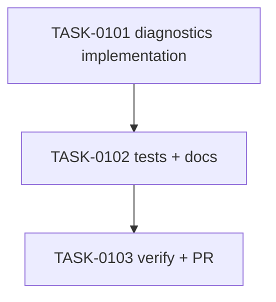

# PLAN-0027: CLI missing script diagnostics

## メタデータ

| フィールド | 内容 |
|-----------|------|
| PLAN-ID   | PLAN-0027 |
| SPEC-ID   | SPEC-0027 |
| ステータス | Completed |
| 作成日    | 2026-05-14 |
| 担当Agent | Planning Agent |

## 変更レイヤ

- [ ] controller
- [ ] usecase
- [x] domain
- [ ] infrastructure
- [ ] frontend
- [ ] infra
- [x] test
- [x] docs

## 影響範囲

- CLI domain: profile diagnostics gains missing script reference checks
- Tests: doctor JSON / strict / package manager parser coverage
- Docs: README / README-ja / CLI docs / roadmap

## 実装方針

`src/cli/profile-diagnostics.mjs` の `diagnoseProfileScripts` に、`ai:check` と `ai:check:fast` の package-manager-aware invocation parser を追加する。実装は read-only な string parsing に限定し、warning message には missing script name のみを出す。

既存 `doctor` は diagnostics warnings をそのまま JSON / human output に渡し、`--strict` で warnings を failure にする behavior をすでに持つため、controller 変更は行わない。

## タスク分解

| TASK-ID | 責務 | 担当Agent | 見積 | 依存TASK | 並列可否 |
|---------|------|----------|------|---------|---------|
| TASK-0101 | missing script diagnostics implementation | Implementation | 35m | none | Yes |
| TASK-0102 | tests and docs | Test+Docs | 45m | TASK-0101 | No |
| TASK-0103 | AC 検証、採点、SAGE status 更新、commit / PR | Verify | 30m | TASK-0101..0102 | No |

## 依存グラフ

## File Scope by Task

| TASK-ID | 変更許可ファイル |
|---|---|
| TASK-0101 | `src/cli/profile-diagnostics.mjs` |
| TASK-0102 | `tests/cli/doctor.test.mjs`, `tests/cli/update.test.mjs`, `docs/cli.md`, `README.md`, `README-ja.md`, `docs/roadmap.md` |
| TASK-0103 | `specs/SPEC-0027-cli-missing-script-diagnostics.md`, `plans/PLAN-0027-cli-missing-script-diagnostics.md`, `tasks/TASK-0101-missing-script-diagnostics.md`, `tasks/TASK-0102-missing-script-diagnostics-tests-docs.md`, `tasks/TASK-0103-verify-missing-script-diagnostics.md` |

## リスク

- custom command false positive → package manager invocation pattern のみ解析する
- duplicate warnings → Set で script names を dedupe する
- overclaiming docs → dependency install / script auto-creation は未実装と明記する

## 必要な検証

- [x] unit test: `node --test tests/cli/doctor.test.mjs`
- [x] integration test: init → doctor missing script warnings / strict behavior
- [x] security scan: secret-like literal grep and doctor read-only snapshot
- [x] e2e test: actual npm publish / npx execution is out of scope（SKIPPED by scope）
- [x] architecture boundary check: File Scope / protected file / `package-templates/**` unchanged

## Error Resolution

| 失敗 | 復旧手順 |
|---|---|
| parser false positive | invocation regex を package manager command に限定する |
| duplicate warning | referenced script Set と missing script Set を分離する |
| strict not failing | doctor strict status handling test を確認する |
| docs overclaim | dependency install / auto-creation claim を削除する |

## Knowledge Management

missing script diagnostics の false positive / false negative が発生した場合、maintainer が command, package manager, package scripts, expected warning, actual warning を `sage/failures.md` に記録する。同種 auto-creation / dependency install request が 3 回発生した場合、`sage/anti-patterns.md` への昇格候補にする。

## 採点

- SPEC-0027: 100/S++（6軸: Codified Rules 20 / Atomic Decomposition 20 / Spec-Driven 20 / Observable 20 / Knowledge 15 / Gradual Adoption 5）
- PLAN-0027: 100/S++（6軸: Codified Rules 20 / Atomic Decomposition 20 / Spec-Driven 20 / Observable 20 / Knowledge 15 / Gradual Adoption 5）
- TASK-0101: 100/S++
- TASK-0102: 100/S++
- TASK-0103: 100/S++
