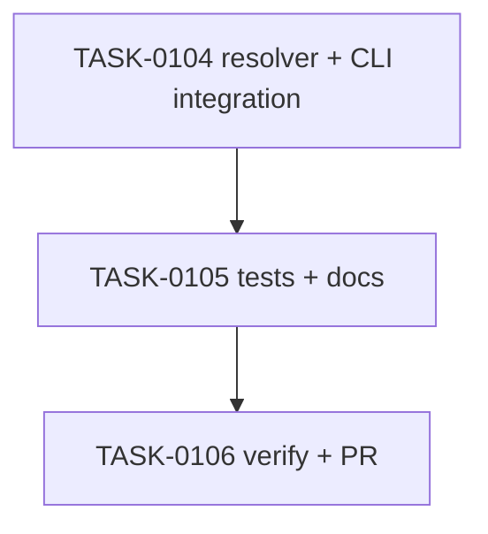

# PLAN-0028: CLI support script defaults

## メタデータ

| フィールド | 内容 |
|-----------|------|
| PLAN-ID   | PLAN-0028 |
| SPEC-ID   | SPEC-0028 |
| ステータス | Completed |
| 作成日    | 2026-05-14 |
| 担当Agent | Planning Agent |

## 変更レイヤ

- [x] controller
- [x] usecase
- [x] domain
- [ ] infrastructure
- [ ] frontend
- [ ] infra
- [x] test
- [x] docs

## 影響範囲

- CLI domain: profile support script defaults resolver
- CLI usecase: init / update package script merge behavior
- Tests: init / doctor / update expectations around missing script warnings
- Docs: README / README-ja / CLI docs / roadmap

## 実装方針

`src/cli/profile-scripts.mjs` に `getProfileSupportScripts` を追加し、`getProfileScripts` とは分離する。`getProfileScripts` は managed check scripts の exact drift 用に維持し、support scripts は `init` / `update` の missing-only merge path だけで使う。

`init` と `update` は profile scripts を処理した後、support defaults を missing の場合だけ追加する。existing support scripts は `--overwrite` があっても保持する。これにより user tool choice を壊さず、SPEC-0027 の `script-advice` warnings を減らす。

## タスク分解

| TASK-ID | 責務 | 担当Agent | 見積 | 依存TASK | 並列可否 |
|---------|------|----------|------|---------|---------|
| TASK-0104 | support script resolver and init/update integration | Implementation | 45m | none | Yes |
| TASK-0105 | tests and docs | Test+Docs | 45m | TASK-0104 | No |
| TASK-0106 | AC 検証、採点、SAGE status 更新、commit / PR | Verify | 30m | TASK-0104..0105 | No |

## 依存グラフ

## File Scope by Task

| TASK-ID | 変更許可ファイル |
|---|---|
| TASK-0104 | `src/cli/profile-scripts.mjs`, `src/cli/init.mjs`, `src/cli/update.mjs` |
| TASK-0105 | `tests/cli/init.test.mjs`, `tests/cli/doctor.test.mjs`, `tests/cli/update.test.mjs`, `docs/cli.md`, `README.md`, `README-ja.md`, `docs/roadmap.md` |
| TASK-0106 | `specs/SPEC-0028-cli-support-script-defaults.md`, `plans/PLAN-0028-cli-support-script-defaults.md`, `tasks/TASK-0104-support-script-resolver.md`, `tasks/TASK-0105-support-script-cli-tests-docs.md`, `tasks/TASK-0106-verify-support-script-defaults.md` |

## リスク

- user script overwrite → support merge は missing-only に限定する
- support defaults overclaim → docs に dependency install はしないと明記する
- doctor strict behavior mismatch → initialized target strict test を追加する

## 必要な検証

- [x] unit test: `node --test tests/cli/*.test.mjs`
- [x] integration test: init / update → support scripts → doctor strict
- [x] security scan: secret-like literal grep and doctor read-only snapshot
- [x] e2e test: actual npm publish / npx execution is out of scope（SKIPPED by scope）
- [x] architecture boundary check: File Scope / protected file / `package-templates/**` unchanged

## Error Resolution

| 失敗 | 復旧手順 |
|---|---|
| support script overwritten | existing script keep branch を修正 |
| doctor strict still warns | support defaults と `ai:check` references の整合を修正 |
| docs overclaim | dependency install / package template claim を削除 |
| File Scope failure | out-of-scope diff を取り除く |

## Knowledge Management

support script default の false default / overwrite regression が発生した場合、maintainer が command, profile, existing scripts, expected operation, actual operation を `sage/failures.md` に記録する。同種 dependency install request が 3 回発生した場合、`sage/anti-patterns.md` への昇格候補にする。

## 採点

- SPEC-0028: 100/S++（6軸: Codified Rules 20 / Atomic Decomposition 20 / Spec-Driven 20 / Observable 20 / Knowledge 15 / Gradual Adoption 5）
- PLAN-0028: 100/S++（6軸: Codified Rules 20 / Atomic Decomposition 20 / Spec-Driven 20 / Observable 20 / Knowledge 15 / Gradual Adoption 5）
- TASK-0104: 100/S++
- TASK-0105: 100/S++
- TASK-0106: 100/S++
