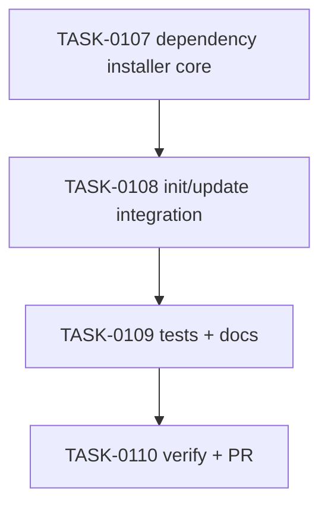

# PLAN-0029: CLI dependency install opt-in

## メタデータ

| フィールド | 内容 |
|-----------|------|
| PLAN-ID   | PLAN-0029 |
| SPEC-ID   | SPEC-0029 |
| ステータス | Completed |
| 作成日    | 2026-05-14 |
| 担当Agent | Planning Agent |

## 変更レイヤ

- [x] controller
- [x] usecase
- [x] domain
- [x] infrastructure
- [ ] frontend
- [ ] infra
- [x] test
- [x] docs

## 影響範囲

- CLI domain: profile-aware npm dev dependency allowlist and missing dependency resolver
- CLI infrastructure: package manager command construction, preflight, and `shell: false` child process execution
- CLI controller/usecase: `init` / `update` `--install-deps` parsing and operation output
- Tests: fake package manager binary fixtures for init/update and package smoke
- Docs: README / README-ja / CLI docs / roadmap

## 実装方針

`src/cli/dependency-installer.mjs` を新設し、dependency allowlist、missing dependency detection、package manager install command construction、binary preflight、command execution をまとめる。package names は fixed allowlist のみから生成し、target package.json の arbitrary value を args に混ぜない。

`init` / `update` は `--install-deps` を parse し、actual write path では target files を変更する前に package manager binary を preflight する。dry-run は preflight せず `would-install` operation のみを出す。actual install は template/package script writes の後に実行し、operations に `install` を追加する。missing package が空なら command は実行せず `keep` operation にする。

## タスク分解

| TASK-ID | 責務 | 担当Agent | 見積 | 依存TASK | 並列可否 |
|---------|------|----------|------|---------|---------|
| TASK-0107 | dependency installer core module | Implementation | 45m | none | Yes |
| TASK-0108 | init/update CLI integration | Implementation | 45m | TASK-0107 | No |
| TASK-0109 | tests and docs | Test+Docs | 45m | TASK-0107, TASK-0108 | No |
| TASK-0110 | AC 検証、採点、SAGE status 更新、commit / PR | Verify | 30m | TASK-0107..0109 | No |

## 依存グラフ

## File Scope by Task

| TASK-ID | 変更許可ファイル |
|---|---|
| TASK-0107 | `src/cli/dependency-installer.mjs` |
| TASK-0108 | `src/cli/init.mjs`, `src/cli/update.mjs`, `src/cli/index.mjs` |
| TASK-0109 | `tests/cli/init.test.mjs`, `tests/cli/update.test.mjs`, `tests/cli/package.test.mjs`, `docs/cli.md`, `README.md`, `README-ja.md`, `docs/roadmap.md` |
| TASK-0110 | `specs/SPEC-0029-cli-dependency-install-opt-in.md`, `plans/PLAN-0029-cli-dependency-install-opt-in.md`, `tasks/TASK-0107-dependency-installer-core.md`, `tasks/TASK-0108-dependency-installer-cli-integration.md`, `tasks/TASK-0109-dependency-installer-tests-docs.md`, `tasks/TASK-0110-verify-dependency-install-opt-in.md` |

## リスク

- actual dependency install by accident in tests → tests use PATH-scoped fake binaries and assert log files
- preflight after partial writes → preflight before any target writes when `--install-deps --yes`
- command injection → command args from fixed allowlist and `shell: false`
- docs overclaim external toolchain support → explicitly exclude Supabase CLI / Maestro / React Doctor install

## 必要な検証

- [x] unit test: dependency resolver via init/update CLI tests
- [x] integration test: fake package manager receives expected install args
- [x] security scan: secret-like literal grep and `shell: false` child process review
- [x] e2e test: real dependency install and actual npm publish are out of scope（SKIPPED by scope）
- [x] architecture boundary check: File Scope / protected file / `package-templates/**` unchanged
- [x] package smoke: `npm pack --dry-run --json` includes new runtime module

## Error Resolution

| 失敗 | 復旧手順 |
|---|---|
| dry-run writes | install planning path を operation-only に戻す |
| fake install args mismatch | package manager command builder / missing dependency resolver を修正 |
| duplicate dependency install | dependency section scan を `dependencies` 系全体に広げる |
| missing binary partial write | preflight call order を target writes より前に戻す |
| File Scope failure | out-of-scope diff を取り除く |

## Knowledge Management

dependency install opt-in の false args / preflight regression が発生した場合、maintainer が command, package manager, profile, existing dependency sections, expected args, actual args を `sage/failures.md` に記録する。external toolchain install request が 3 回発生した場合、`sage/anti-patterns.md` への昇格候補にする。

## 採点

- SPEC-0029: 100/S++（6軸: Codified Rules 20 / Atomic Decomposition 20 / Spec-Driven 20 / Observable 20 / Knowledge 15 / Gradual Adoption 5）
- PLAN-0029: 100/S++（6軸: Codified Rules 20 / Atomic Decomposition 20 / Spec-Driven 20 / Observable 20 / Knowledge 15 / Gradual Adoption 5）
- TASK-0107: 100/S++
- TASK-0108: 100/S++
- TASK-0109: 100/S++
- TASK-0110: 100/S++
