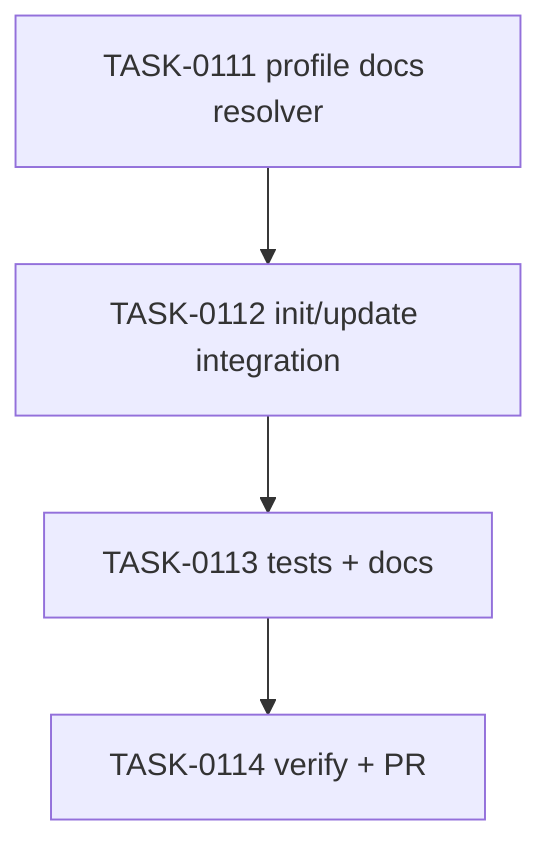

# PLAN-0030: CLI profile document migrations

## メタデータ

| フィールド | 内容 |
|-----------|------|
| PLAN-ID   | PLAN-0030 |
| SPEC-ID   | SPEC-0030 |
| ステータス | Completed |
| 作成日    | 2026-05-14 |
| 担当Agent | Planning Agent |

## 変更レイヤ

- [x] controller
- [x] usecase
- [x] domain
- [x] infrastructure
- [ ] frontend
- [ ] infra
- [x] test
- [x] docs

## 影響範囲

- CLI domain: selected profile to docs file plan mapping
- CLI usecase: init / update docs copy/create behavior
- CLI infrastructure: safe file copy for missing target docs
- Tests: init / update fixture assertions and package smoke
- Docs: README / README-ja / CLI docs / roadmap

## 実装方針

`src/cli/profile-docs.mjs` に fixed common docs と selected profile docs の mapping を追加する。source は `fromTemplates(...)` からのみ作り、target relative path は `docs/ai-check-template/` 配下に限定する。profile README の既存相対リンクを保つため、`docs/`, `prompts/`, `profiles/` の package-template-like structure を target root 配下に維持する。

`init` は既存 `copyFileSafe` を使って profile docs を copy する。default では existing files を skip し、`--overwrite` がある場合だけ existing docs を overwrite する。`update` は missing docs を create し、existing docs は内容差分に関係なく `keep` して上書きしない。

## タスク分解

| TASK-ID | 責務 | 担当Agent | 見積 | 依存TASK | 並列可否 |
|---------|------|----------|------|---------|---------|
| TASK-0111 | profile docs resolver | Implementation | 35m | none | Yes |
| TASK-0112 | init/update profile docs integration | Implementation | 45m | TASK-0111 | No |
| TASK-0113 | tests and docs | Test+Docs | 45m | TASK-0111, TASK-0112 | No |
| TASK-0114 | AC 検証、採点、SAGE status 更新、commit / PR | Verify | 30m | TASK-0111..0113 | No |

## 依存グラフ

## File Scope by Task

| TASK-ID | 変更許可ファイル |
|---|---|
| TASK-0111 | `src/cli/profile-docs.mjs` |
| TASK-0112 | `src/cli/init.mjs`, `src/cli/update.mjs` |
| TASK-0113 | `tests/cli/init.test.mjs`, `tests/cli/update.test.mjs`, `tests/cli/package.test.mjs`, `docs/cli.md`, `README.md`, `README-ja.md`, `docs/roadmap.md` |
| TASK-0114 | `specs/SPEC-0030-cli-profile-doc-migrations.md`, `plans/PLAN-0030-cli-profile-doc-migrations.md`, `tasks/TASK-0111-profile-docs-resolver.md`, `tasks/TASK-0112-profile-docs-cli-integration.md`, `tasks/TASK-0113-profile-docs-tests-docs.md`, `tasks/TASK-0114-verify-profile-doc-migrations.md` |

## リスク

- target docs overwrite → update create-missing only、init default skip
- broken copied links → package-template-like structure を target に保持
- scope creep into doctor docs diagnostics → SPEC で scope 外化
- package smoke missing module → `tests/cli/package.test.mjs` required files 更新

## 必要な検証

- [x] unit test: profile docs copied by init for base/addon profile
- [x] integration test: update creates missing docs and keeps existing docs
- [x] security scan: secret-like literal grep and path allowlist review
- [x] e2e test: real npm publish is out of scope（SKIPPED by scope）
- [x] architecture boundary check: File Scope / protected file / `package-templates/**` unchanged
- [x] package smoke: `npm pack --dry-run --json` includes new runtime module

## Error Resolution

| 失敗 | 復旧手順 |
|---|---|
| selected profile doc missing | resolver base/addon mapping を修正 |
| unselected doc copied | selected-only mapping を修正 |
| existing docs overwritten | update existing branch を keep に戻す |
| dry-run writes | copy/create path の dry-run handling を修正 |
| File Scope failure | out-of-scope diff を取り除く |

## Knowledge Management

profile docs migration の false mapping / overwrite regression が発生した場合、maintainer が command, profile, expected files, actual files, existing target content を `sage/failures.md` に記録する。docs diagnostics / cleanup request が 3 回発生した場合、`sage/anti-patterns.md` への昇格候補にする。

## 採点

- SPEC-0030: 100/S++（6軸: Codified Rules 20 / Atomic Decomposition 20 / Spec-Driven 20 / Observable 20 / Knowledge 15 / Gradual Adoption 5）
- PLAN-0030: 100/S++（6軸: Codified Rules 20 / Atomic Decomposition 20 / Spec-Driven 20 / Observable 20 / Knowledge 15 / Gradual Adoption 5）
- TASK-0111: 100/S++
- TASK-0112: 100/S++
- TASK-0113: 100/S++
- TASK-0114: 100/S++
