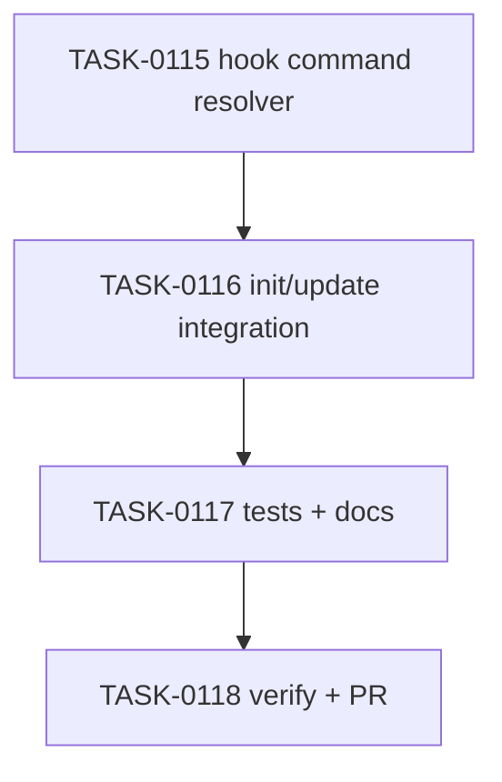

# PLAN-0031: CLI Claude hook package manager rendering

## メタデータ

| フィールド | 内容 |
|-----------|------|
| PLAN-ID   | PLAN-0031 |
| SPEC-ID   | SPEC-0031 |
| ステータス | Completed |
| 作成日    | 2026-05-16 |
| 担当Agent | Planning Agent |

## 変更レイヤ

- [x] controller
- [x] usecase
- [x] domain
- [x] infrastructure
- [ ] frontend
- [ ] infra
- [x] test
- [x] docs

## 影響範囲

- CLI domain: package manager to Claude hook command rendering
- CLI usecase: init / update hook settings merge and update behavior
- CLI infrastructure: JSON settings read/write through existing helpers
- Tests: init / update fixture assertions and package smoke
- Docs: README / README-ja / CLI docs / roadmap

## 実装方針

`src/cli/claude-hooks.mjs` に hook fragment renderer を追加する。renderer は existing `scriptCommand(packageManager, scriptName)` と `validatePackageManager(packageManager)` を使い、known managed command の `pnpm ai:check:fast` と `pnpm ai:check` だけを target package manager の script command に変換する。unknown command は custom command として preserve する。

`init` は template fragment を読み込んだ直後に renderer を通し、既存 merge semantics を維持する。default では existing hook group を skip / preserve し、`--overwrite` の場合だけ rendered hook group で置き換える。`update` は effective options 解決後の package manager で rendered fragment を作り、existing hook group と比較して keep / update / create を決める。dry-run は operation を返すだけで write しない。

## タスク分解

| TASK-ID | 責務 | 担当Agent | 見積 | 依存TASK | 並列可否 |
|---------|------|----------|------|---------|---------|
| TASK-0115 | Claude hook command resolver | Implementation | 30m | none | Yes |
| TASK-0116 | init/update hook rendering integration | Implementation | 35m | TASK-0115 | No |
| TASK-0117 | tests and docs | Test+Docs | 45m | TASK-0115, TASK-0116 | No |
| TASK-0118 | AC 検証、採点、SAGE status 更新、commit / PR | Verify | 30m | TASK-0115..0117 | No |

## 依存グラフ

## File Scope by Task

| TASK-ID | 変更許可ファイル |
|---|---|
| TASK-0115 | `src/cli/claude-hooks.mjs` |
| TASK-0116 | `src/cli/init.mjs`, `src/cli/update.mjs` |
| TASK-0117 | `tests/cli/init.test.mjs`, `tests/cli/update.test.mjs`, `tests/cli/package.test.mjs`, `docs/cli.md`, `README.md`, `README-ja.md`, `docs/roadmap.md` |
| TASK-0118 | `specs/SPEC-0031-cli-claude-hook-package-manager.md`, `plans/PLAN-0031-cli-claude-hook-package-manager.md`, `tasks/TASK-0115-claude-hook-command-resolver.md`, `tasks/TASK-0116-claude-hook-cli-integration.md`, `tasks/TASK-0117-claude-hook-tests-docs.md`, `tasks/TASK-0118-verify-claude-hook-package-manager.md` |

## リスク

- custom hook command mutation → resolver only converts exact known managed commands
- init overwrite regression → tests cover default preserve and explicit overwrite
- update effective option regression → tests cover explicit package manager update from pnpm to npm
- package payload missing module → package smoke required file is updated

## 必要な検証

- [x] unit test: renderer maps managed hook commands for pnpm / npm / yarn / bun
- [x] integration test: init writes npm hook commands and no generated pnpm command
- [x] integration test: init preserves existing hook group unless `--overwrite` is passed
- [x] integration test: update converts existing pnpm hook commands to npm via effective package manager
- [x] integration test: dry-run update leaves settings unchanged
- [x] security scan: invalid package manager reject and secret-like literal grep
- [x] architecture boundary check: File Scope / protected file / `package-templates/**` unchanged
- [x] package smoke: `npm pack --dry-run --json` includes new runtime module
- [x] e2e release: npm publish is out of scope（SKIPPED by scope）

## Error Resolution

| 失敗 | 復旧手順 |
|---|---|
| wrong command for npm/yarn/bun | resolver mapping を `scriptCommand` 経由に戻す |
| unknown command mutated | exact known command branch のみに絞る |
| init overwrites existing hooks | merge branch の `!options.overwrite` skip を戻す |
| update does not migrate commands | expected fragment を rendered fragment に差し替える |
| dry-run writes | write guard を `!options.dryRun` または existing helper に戻す |
| File Scope failure | out-of-scope diff を取り除く |

## Knowledge Management

hook command mismatch / overwrite regression が発生した場合、maintainer が command, package manager, expected hook command, actual hook command, operation output を `sage/failures.md` に記録する。hook diagnostics / template redesign request が 3 回発生した場合、`sage/anti-patterns.md` への昇格候補にする。

## 採点

- SPEC-0031: 100/S++（6軸: Codified Rules 20 / Atomic Decomposition 20 / Spec-Driven 20 / Observable 20 / Knowledge 15 / Gradual Adoption 5）
- PLAN-0031: 100/S++（6軸: Codified Rules 20 / Atomic Decomposition 20 / Spec-Driven 20 / Observable 20 / Knowledge 15 / Gradual Adoption 5）
- TASK-0115: 100/S++
- TASK-0116: 100/S++
- TASK-0117: 100/S++
- TASK-0118: 100/S++
