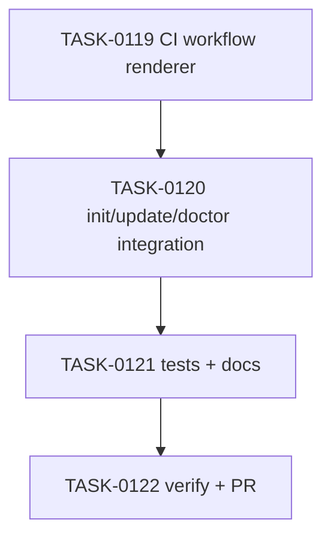

# PLAN-0032: CLI CI workflow package manager rendering

## メタデータ

| フィールド | 内容 |
|-----------|------|
| PLAN-ID   | PLAN-0032 |
| SPEC-ID   | SPEC-0032 |
| ステータス | Completed |
| 作成日    | 2026-05-16 |
| 担当Agent | Planning Agent |

## 変更レイヤ

- [x] controller
- [x] usecase
- [x] domain
- [x] infrastructure
- [ ] frontend
- [x] infra
- [x] test
- [x] docs

## 影響範囲

- CLI domain: package manager to workflow install/check command rendering
- CLI usecase: init / update / doctor CI workflow behavior
- CLI infrastructure: managed workflow exact-match cleanup detection
- Tests: init / update / doctor fixture assertions and package smoke
- Docs: README / README-ja / CLI docs / roadmap

## 実装方針

`src/cli/ci-workflows.mjs` に fixed workflow file names の renderer を追加する。direct workflow は package manager ごとの setup/install block と `scriptCommand(packageManager, "ai:check*")` を使って render する。reusable workflow は `ai-quality-reusable.yml` を template のまま保持し、caller `ai-quality-call.yml` の `package-manager` と `check-command` だけを render する。

`init` は CI file copy を rendered content write に差し替える。`update` は rendered content で keep / update / create を判定する。inactive workflow cleanup と doctor diagnostics は、all package manager variants の rendered content と exact match した場合のみ managed と扱う。custom workflow は保持する。

## タスク分解

| TASK-ID | 責務 | 担当Agent | 見積 | 依存TASK | 並列可否 |
|---------|------|----------|------|---------|---------|
| TASK-0119 | CI workflow renderer | Implementation | 35m | none | Yes |
| TASK-0120 | init/update/doctor integration | Implementation | 45m | TASK-0119 | No |
| TASK-0121 | tests and docs | Test+Docs | 45m | TASK-0119, TASK-0120 | No |
| TASK-0122 | AC 検証、採点、SAGE status 更新、commit / PR | Verify | 30m | TASK-0119..0121 | No |

## 依存グラフ

## File Scope by Task

| TASK-ID | 変更許可ファイル |
|---|---|
| TASK-0119 | `src/cli/ci-workflows.mjs` |
| TASK-0120 | `src/cli/init.mjs`, `src/cli/update.mjs`, `src/cli/doctor.mjs` |
| TASK-0121 | `tests/cli/init.test.mjs`, `tests/cli/update.test.mjs`, `tests/cli/doctor.test.mjs`, `tests/cli/package.test.mjs`, `docs/cli.md`, `README.md`, `README-ja.md`, `docs/roadmap.md` |
| TASK-0122 | `specs/SPEC-0032-cli-ci-workflow-package-manager.md`, `plans/PLAN-0032-cli-ci-workflow-package-manager.md`, `tasks/TASK-0119-ci-workflow-renderer.md`, `tasks/TASK-0120-ci-workflow-cli-integration.md`, `tasks/TASK-0121-ci-workflow-tests-docs.md`, `tasks/TASK-0122-verify-ci-workflow-package-manager.md` |

## 必要な検証

- [x] integration test: init direct workflows render npm / yarn / bun / pnpm commands
- [x] integration test: init reusable caller renders package manager and check command
- [x] integration test: update migrates managed pnpm workflow to npm
- [x] integration test: doctor passes for npm-rendered workflows and flags stale pnpm direct workflow
- [x] integration test: inactive cleanup recognizes rendered variants and preserves custom workflows
- [x] security scan: invalid package manager reject and secret-like literal grep
- [x] architecture boundary check: File Scope / protected file / `package-templates/**` unchanged
- [x] package smoke: `npm pack --dry-run --json` includes new runtime module
- [x] e2e release: actual npm publish is out of scope（SKIPPED by scope）

## Error Resolution

| 失敗 | 復旧手順 |
|---|---|
| direct workflow command mismatch | renderer command table と `scriptCommand` usage を修正 |
| reusable caller mismatch | caller replacements を package manager / check-command に限定して修正 |
| doctor false drift | expected content を rendered workflow に統一する |
| custom workflow deleted | managed detection を exact rendered variants のみに戻す |
| dry-run writes | write guard を `!options.dryRun` に戻す |
| File Scope failure | out-of-scope diff を取り除く |

## Knowledge Management

CI workflow package manager mismatch / custom cleanup regression が発生した場合、maintainer が command, package manager, expected workflow snippet, actual workflow snippet, operation output を `sage/failures.md` に記録する。profile-specific CI matrix request が 3 回発生した場合、`sage/anti-patterns.md` への昇格候補にする。

## 採点

- SPEC-0032: 100/S++（6軸: Codified Rules 20 / Atomic Decomposition 20 / Spec-Driven 20 / Observable 20 / Knowledge 15 / Gradual Adoption 5）
- PLAN-0032: 100/S++（6軸: Codified Rules 20 / Atomic Decomposition 20 / Spec-Driven 20 / Observable 20 / Knowledge 15 / Gradual Adoption 5）
- TASK-0119: 100/S++
- TASK-0120: 100/S++
- TASK-0121: 100/S++
- TASK-0122: 100/S++
