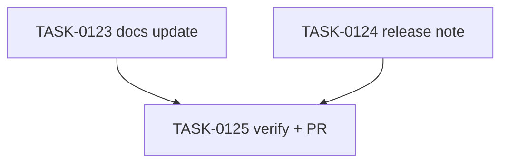

# PLAN-0033: npm publish completion

## メタデータ

| フィールド | 内容 |
|-----------|------|
| PLAN-ID   | PLAN-0033 |
| SPEC-ID   | SPEC-0033 |
| ステータス | Completed |
| 作成日    | 2026-05-16 |
| 担当Agent | Planning Agent |

## 変更レイヤ

- [ ] controller
- [ ] usecase
- [ ] domain
- [ ] infrastructure
- [ ] frontend
- [ ] infra
- [x] test
- [x] docs

## 影響範囲

- Docs: README / README-ja / CLI docs / roadmap / release note
- Verification: npm registry visibility and npx smoke evidence
- SAGE: SPEC / PLAN / TASK status and scoring

## 実装方針

README / README-ja の quick start に `npx -y ai-check-template@next init` を primary alpha path として追加する。`docs/cli.md` は repository-local only の表現を削除し、npm published alpha package と local clone path の両方を示す。`docs/roadmap.md` は npm publish item を Done にし、v0.2.0 status を published alpha に更新する。`docs/releases/v0.2.0-alpha.0.md` に publish と smoke evidence を残す。

## タスク分解

| TASK-ID | 責務 | 担当Agent | 見積 | 依存TASK | 並列可否 |
|---------|------|----------|------|---------|---------|
| TASK-0123 | README / CLI docs / roadmap update | Docs | 35m | none | Yes |
| TASK-0124 | v0.2.0-alpha.0 release note | Docs | 25m | none | Yes |
| TASK-0125 | AC 検証、採点、SAGE status 更新、commit / PR | Verify | 30m | TASK-0123, TASK-0124 | No |

## 依存グラフ

## File Scope by Task

| TASK-ID | 変更許可ファイル |
|---|---|
| TASK-0123 | `README.md`, `README-ja.md`, `docs/cli.md`, `docs/roadmap.md` |
| TASK-0124 | `docs/releases/v0.2.0-alpha.0.md` |
| TASK-0125 | `specs/SPEC-0033-npm-publish-completion.md`, `plans/PLAN-0033-npm-publish-completion.md`, `tasks/TASK-0123-npm-publish-docs.md`, `tasks/TASK-0124-npm-publish-release-note.md`, `tasks/TASK-0125-verify-npm-publish-completion.md` |

## 必要な検証

- [x] docs grep: README / README-ja / `docs/cli.md` mention `npx -y ai-check-template@next init`
- [x] release note grep: `docs/releases/v0.2.0-alpha.0.md` exists and mentions `0.2.0-alpha.0`
- [x] registry check: `npm view ai-check-template version dist-tags --json`
- [x] npx smoke: dry-run / write / doctor for `node-cli` + `npm` + `ci none`
- [x] repo validation: `node --test tests/cli/*.test.mjs`, `make validate`, `bash scripts/sage-validate.sh`, `git diff --check`
- [x] security scan: npm token / auth URL / OTP / secret-like literal grep
- [x] architecture boundary check: File Scope / protected file / package contents unchanged

## Error Resolution

| 失敗 | 復旧手順 |
|---|---|
| npx smoke fails | package availability / smoke args / CLI regression を切り分ける |
| docs overclaim stable | alpha / `@next` wording に戻す |
| auth material detected |該当文字列を docs から削除 |
| File Scope failure | out-of-scope diff を取り除く |

## Knowledge Management

npm registry propagation delay / npx smoke regression が発生した場合、maintainer が command, expected output, actual output, retry timing を `sage/failures.md` に記録する。alpha/stable confusion が 3 回発生した場合、`sage/anti-patterns.md` への昇格候補にする。

## 採点

- SPEC-0033: 100/S++（6軸: Codified Rules 20 / Atomic Decomposition 20 / Spec-Driven 20 / Observable 20 / Knowledge 15 / Gradual Adoption 5）
- PLAN-0033: 100/S++（6軸: Codified Rules 20 / Atomic Decomposition 20 / Spec-Driven 20 / Observable 20 / Knowledge 15 / Gradual Adoption 5）
- TASK-0123: 100/S++
- TASK-0124: 100/S++
- TASK-0125: 100/S++
