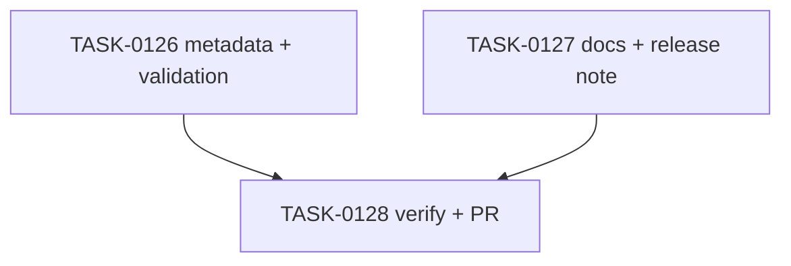

# PLAN-0034: v0.2.0 stable release prep

## メタデータ

| フィールド | 内容 |
|-----------|------|
| PLAN-ID   | PLAN-0034 |
| SPEC-ID   | SPEC-0034 |
| ステータス | Completed |
| 作成日    | 2026-05-16 |
| 担当Agent | Planning Agent |

## 変更レイヤ

- [ ] controller
- [ ] usecase
- [ ] domain
- [ ] infrastructure
- [ ] frontend
- [x] infra
- [x] test
- [x] docs

## 影響範囲

- Package metadata: `package.json` version
- Validation: `Makefile` publish dry-run and version assertions
- Tests: install state package version expectation
- Docs: README / README-ja / CLI docs / roadmap / v0.2.0 release note
- SAGE: SPEC / PLAN / TASK status and scoring

## 実装方針

Stable release prep は runtime code を変えず、package metadata / validation / docs の同期に限定する。`package.json` を `0.2.0` に更新し、`make validate` を stable publish candidate として `npm publish --dry-run --tag latest --json` に合わせる。README / CLI docs は default npm path `npx -y ai-check-template init` を primary にし、alpha `@next` は release history として残す。

Actual `npm publish`, dist-tag mutation, tag push, GitHub Release creation はこの PR では行わず、merge 後の明示確認フローに分離する。

## タスク分解

| TASK-ID | 責務 | 担当Agent | 見積 | 依存TASK | 並列可否 |
|---------|------|----------|------|---------|---------|
| TASK-0126 | package metadata / validation / test expectation update | Release | 25m | none | Yes |
| TASK-0127 | stable docs and release note update | Docs | 35m | none | Yes |
| TASK-0128 | AC 検証、採点、SAGE status 更新、commit / PR | Verify | 30m | TASK-0126, TASK-0127 | No |

## 依存グラフ

## File Scope by Task

| TASK-ID | 変更許可ファイル |
|---|---|
| TASK-0126 | `package.json`, `Makefile`, `tests/cli/init.test.mjs` |
| TASK-0127 | `README.md`, `README-ja.md`, `docs/cli.md`, `docs/roadmap.md`, `docs/releases/v0.2.0.md` |
| TASK-0128 | `specs/SPEC-0034-v0.2.0-stable-release-prep.md`, `plans/PLAN-0034-v0.2.0-stable-release-prep.md`, `tasks/TASK-0126-v0.2.0-stable-metadata.md`, `tasks/TASK-0127-v0.2.0-stable-docs.md`, `tasks/TASK-0128-verify-v0.2.0-stable-release-prep.md` |

## 必要な検証

- [x] package grep: `package.json` version is `0.2.0`
- [x] test grep: install state expectation is `0.2.0`
- [x] docs grep: README / README-ja / `docs/cli.md` mention `npx -y ai-check-template init`
- [x] release note grep: `docs/releases/v0.2.0.md` exists and mentions `0.2.0`
- [x] publish dry-run: `npm publish --dry-run --tag latest --json`
- [x] repo validation: `node --test tests/cli/*.test.mjs`, `make validate`, `bash scripts/sage-validate.sh`, `git diff --check`
- [x] security scan: npm token / auth URL / OTP / email / secret-like literal grep
- [x] architecture boundary check: File Scope / protected file / runtime source unchanged

## Error Resolution

| 失敗 | 復旧手順 |
|---|---|
| publish dry-run fails | package version / files / npm dist-tag args を確認 |
| docs overclaim published state | release prep wording に戻す |
| auth material detected | 該当文字列を docs から削除 |
| File Scope failure | out-of-scope diff を取り除く |

## Knowledge Management

stable publish dry-run failure / alpha-stable docs confusion が発生した場合、maintainer が command, expected output, actual output, retry timing を `sage/failures.md` に記録する。registry write は本 PR の scope 外のため、実 publish 失敗は follow-up SPEC に分離する。

## 採点

- SPEC-0034: 100/S++（6軸: Codified Rules 20 / Atomic Decomposition 20 / Spec-Driven 20 / Observable 20 / Knowledge 15 / Gradual Adoption 5）
- PLAN-0034: 100/S++（6軸: Codified Rules 20 / Atomic Decomposition 20 / Spec-Driven 20 / Observable 20 / Knowledge 15 / Gradual Adoption 5）
- TASK-0126: 100/S++
- TASK-0127: 100/S++
- TASK-0128: 100/S++
