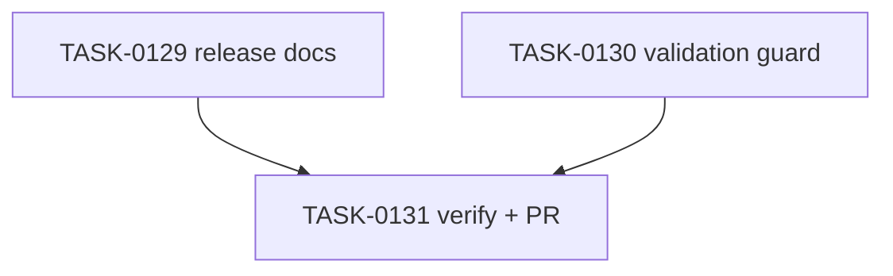

# PLAN-0035: v0.2.0 release completion docs

## メタデータ

| フィールド | 内容 |
|-----------|------|
| PLAN-ID   | PLAN-0035 |
| SPEC-ID   | SPEC-0035 |
| ステータス | Completed |
| 作成日    | 2026-05-16 |
| 担当Agent | Planning Agent |

## 変更レイヤ

- [ ] controller
- [ ] usecase
- [ ] domain
- [ ] infrastructure
- [ ] frontend
- [x] infra
- [x] test
- [x] docs

## 影響範囲

- Docs: README / README-ja / CLI docs / roadmap / release note / package template index
- Validation: Makefile structural guard
- SAGE: SPEC / PLAN / TASK status and scoring

## 実装方針

release prep 表現を Released 表現に置き換え、`ai-check-template@0.2.0` の registry state、`npx` smoke、`v0.2.0` tag、GitHub Release を release notes に記録する。runtime code、package metadata、template content、registry state は変更しない。

## タスク分解

| TASK-ID | 責務 | 担当Agent | 見積 | 依存TASK | 並列可否 |
|---------|------|----------|------|---------|---------|
| TASK-0129 | v0.2.0 release docs update | Docs | 35m | none | Yes |
| TASK-0130 | Makefile release completion guard | Validation | 15m | TASK-0129 | Yes |
| TASK-0131 | AC 検証、採点、SAGE status 更新、commit / PR | Verify | 30m | TASK-0129, TASK-0130 | No |

## 依存グラフ

## File Scope by Task

| TASK-ID | 変更許可ファイル |
|---|---|
| TASK-0129 | `README.md`, `README-ja.md`, `docs/cli.md`, `docs/roadmap.md`, `docs/releases/v0.2.0.md`, `package-templates/README.md` |
| TASK-0130 | `Makefile` |
| TASK-0131 | `specs/SPEC-0035-v0.2.0-release-completion.md`, `plans/PLAN-0035-v0.2.0-release-completion.md`, `tasks/TASK-0129-v0.2.0-release-docs.md`, `tasks/TASK-0130-v0.2.0-release-validation.md`, `tasks/TASK-0131-verify-v0.2.0-release-completion.md` |

## 必要な検証

- [x] docs grep: README / README-ja / roadmap mark v0.2.0 Released
- [x] cli grep: `docs/cli.md` says published stable CLI
- [x] release note grep: npm latest / npx smoke / tag / GitHub Release evidence
- [x] registry check: `npm view ai-check-template version dist-tags --json`
- [x] release check: `gh release view v0.2.0 --json tagName,isDraft,isPrerelease,url`
- [x] repo validation: `node --test tests/cli/*.test.mjs`, `make validate`, `bash scripts/sage-validate.sh`, `git diff --check`
- [x] security scan: npm token / auth URL / OTP / email / local temp path / secret-like literal grep
- [x] architecture boundary check: File Scope / protected file / runtime source unchanged

## Error Resolution

| 失敗 | 復旧手順 |
|---|---|
| registry state stale | propagation 待ち後に再実行 |
| docs still say prep | Released wording に更新 |
| auth material detected | 該当文字列を docs から削除 |
| File Scope failure | out-of-scope diff を取り除く |

## Knowledge Management

registry propagation delay / release docs mismatch が発生した場合、maintainer が command, expected output, actual output, retry timing を `sage/failures.md` に記録する。alpha/stable docs confusion が 3 回発生した場合、`sage/anti-patterns.md` への昇格候補にする。

## 採点

- SPEC-0035: 100/S++（6軸: Codified Rules 20 / Atomic Decomposition 20 / Spec-Driven 20 / Observable 20 / Knowledge 15 / Gradual Adoption 5）
- PLAN-0035: 100/S++（6軸: Codified Rules 20 / Atomic Decomposition 20 / Spec-Driven 20 / Observable 20 / Knowledge 15 / Gradual Adoption 5）
- TASK-0129: 100/S++
- TASK-0130: 100/S++
- TASK-0131: 100/S++
