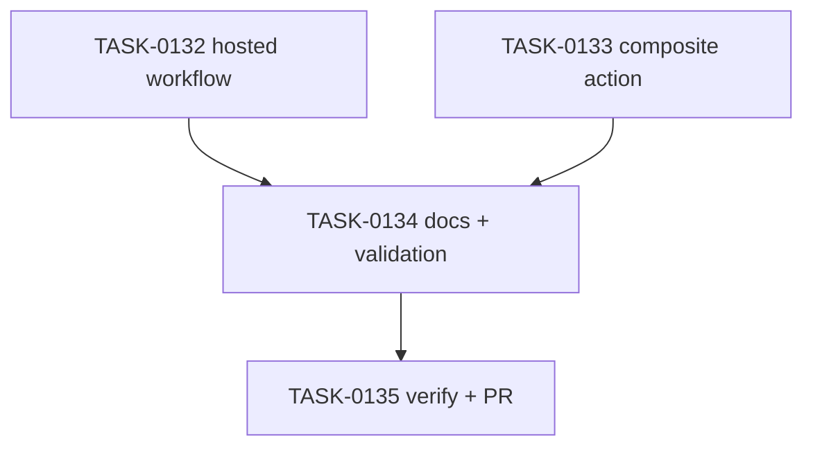

# PLAN-0036: v0.3.0 GitHub Action foundation

## メタデータ

| フィールド | 内容 |
|-----------|------|
| PLAN-ID   | PLAN-0036 |
| SPEC-ID   | SPEC-0036 |
| ステータス | Completed |
| 作成日    | 2026-05-16 |
| 担当Agent | Planning Agent |

## 変更レイヤ

- [ ] controller
- [ ] usecase
- [ ] domain
- [x] infrastructure
- [ ] frontend
- [x] infra
- [x] test
- [x] docs

## 影響範囲

- GitHub Actions: hosted reusable workflow and Composite Action metadata
- Docs: README / README-ja / roadmap / GitHub Actions guide / CI examples README
- Validation: Makefile structural guard and YAML parse
- SAGE: SPEC / PLAN / TASK status and scoring

## 実装方針

既存の `package-templates/ci-examples` は copy-and-adapt example として残す。v0.3.0 foundation は repository root に `.github/workflows/ai-quality.yml` と `ai-quality/action.yml` を追加し、external repos が release tag pin で参照できる hosted contract にする。Composite Action は checkout 済み workspace を前提にし、hosted reusable workflow は checkout を含める。

## タスク分解

| TASK-ID | 責務 | 担当Agent | 見積 | 依存TASK | 並列可否 |
|---------|------|----------|------|---------|---------|
| TASK-0132 | hosted reusable workflow | Infra | 30m | none | Yes |
| TASK-0133 | Composite Action foundation | Infra | 30m | none | Yes |
| TASK-0134 | docs and validation guard | Docs | 40m | TASK-0132, TASK-0133 | No |
| TASK-0135 | AC 検証、採点、SAGE status 更新、commit / PR | Verify | 30m | TASK-0132..0134 | No |

## 依存グラフ

## File Scope by Task

| TASK-ID | 変更許可ファイル |
|---|---|
| TASK-0132 | `.github/workflows/ai-quality.yml` |
| TASK-0133 | `ai-quality/action.yml` |
| TASK-0134 | `docs/github-actions.md`, `README.md`, `README-ja.md`, `docs/roadmap.md`, `package-templates/ci-examples/README.md`, `Makefile` |
| TASK-0135 | `specs/SPEC-0036-v0.3.0-github-action-foundation.md`, `plans/PLAN-0036-v0.3.0-github-action-foundation.md`, `tasks/TASK-0132-hosted-reusable-workflow.md`, `tasks/TASK-0133-composite-action-foundation.md`, `tasks/TASK-0134-github-action-docs-validation.md`, `tasks/TASK-0135-verify-github-action-foundation.md` |

## 必要な検証

- [x] YAML parse: `make validate-yaml`
- [x] structure grep: hosted workflow `workflow_call`, action `runs.using: composite`, required inputs
- [x] docs grep: README / README-ja / roadmap / docs/github-actions.md links
- [x] security scan: secret / token / private URL grep
- [x] repo validation: `node --test tests/cli/*.test.mjs`, `make validate`, `bash scripts/sage-validate.sh`, `git diff --check`
- [x] architecture boundary check: File Scope / protected file / runtime source unchanged

## Error Resolution

| 失敗 | 復旧手順 |
|---|---|
| YAML parse fails | YAML indentation / expression quoting を修正 |
| docs overclaim release | foundation / release tag follow-up wording に戻す |
| action contract unclear | docs/github-actions.md の usage examples を修正 |
| File Scope failure | out-of-scope diff を取り除く |

## Knowledge Management

hosted workflow/action contract confusion が発生した場合、maintainer が command, expected output, actual output, affected file を `sage/failures.md` に記録する。同じ confusion が 3 回累積した場合は `sage/anti-patterns.md` への昇格候補にする。Marketplace readiness gap は follow-up SPEC に分離する。

## 採点

- SPEC-0036: 100/S++（6軸: Codified Rules 20 / Atomic Decomposition 20 / Spec-Driven 20 / Observable 20 / Knowledge 15 / Gradual Adoption 5）
- PLAN-0036: 100/S++（6軸: Codified Rules 20 / Atomic Decomposition 20 / Spec-Driven 20 / Observable 20 / Knowledge 15 / Gradual Adoption 5）
- TASK-0132: 100/S++
- TASK-0133: 100/S++
- TASK-0134: 100/S++
- TASK-0135: 100/S++
