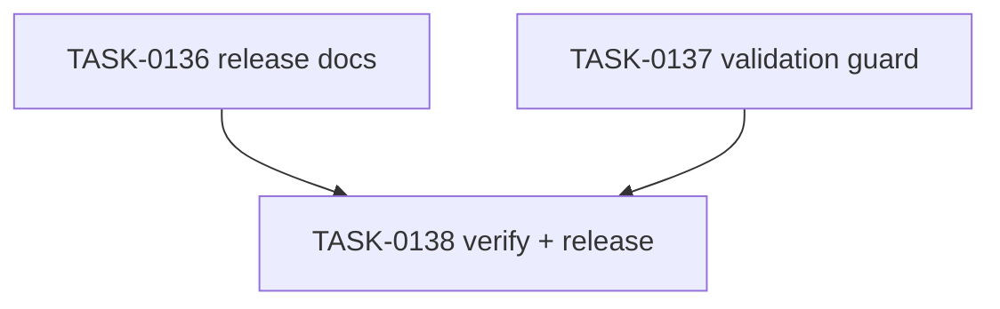

# PLAN-0037: v0.3.0 release operation

## メタデータ

| フィールド | 内容 |
|-----------|------|
| PLAN-ID   | PLAN-0037 |
| SPEC-ID   | SPEC-0037 |
| ステータス | Completed |
| 作成日    | 2026-05-16 |
| 担当Agent | Planning Agent |

## 変更レイヤ

- [ ] controller
- [ ] usecase
- [ ] domain
- [ ] infrastructure
- [ ] frontend
- [x] infra
- [x] test
- [x] docs

## 影響範囲

- Docs: README / README-ja / roadmap / GitHub Actions guide / v0.3.0 release notes / CI examples README
- Validation: Makefile structural guard
- Release operation: Git tag and GitHub Release after PR merge
- SAGE: SPEC / PLAN / TASK status and scoring

## 実装方針

v0.3.0 を npm package release ではなく GitHub Actions integration release として表現する。docs は `@v0.3.0` exact pin を primary にし、future `@v1` major alias と Marketplace listing は planned に留める。release tag は PR merge 後の clean `main` にのみ作成する。

## タスク分解

| TASK-ID | 責務 | 担当Agent | 見積 | 依存TASK | 並列可否 |
|---------|------|----------|------|---------|---------|
| TASK-0136 | v0.3.0 release docs update | Docs | 30m | none | Yes |
| TASK-0137 | v0.3.0 release validation guard | Validation | 20m | TASK-0136 | Yes |
| TASK-0138 | AC 検証、採点、SAGE status 更新、commit / PR / tag / Release | Verify | 35m | TASK-0136, TASK-0137 | No |

## 依存グラフ

## File Scope by Task

| TASK-ID | 変更許可ファイル |
|---|---|
| TASK-0136 | `docs/releases/v0.3.0.md`, `README.md`, `README-ja.md`, `docs/roadmap.md`, `docs/github-actions.md`, `package-templates/ci-examples/README.md` |
| TASK-0137 | `Makefile` |
| TASK-0138 | `specs/SPEC-0037-v0.3.0-release.md`, `plans/PLAN-0037-v0.3.0-release.md`, `tasks/TASK-0136-v0.3.0-release-docs.md`, `tasks/TASK-0137-v0.3.0-release-validation.md`, `tasks/TASK-0138-verify-v0.3.0-release.md` |

## 必要な検証

- [x] docs grep: README / README-ja / roadmap mark v0.3.0 Released and link release notes
- [x] guide grep: `docs/github-actions.md` explains `@v0.3.0` exact pin, future `@v1`, Marketplace planned
- [x] release notes grep: Highlights / Install / Verification / Limitations / Next
- [x] repo validation: `node --test tests/cli/*.test.mjs`, `make validate`, `bash scripts/sage-validate.sh`, `git diff --check`
- [x] security scan: secret / token / auth URL / private URL grep
- [x] architecture boundary check: File Scope / protected file / package-runtime-workflow unchanged
- [x] post-merge release check: `git tag --list v0.3.0`, `gh release view v0.3.0 --json tagName,isDraft,isPrerelease,url`

## Error Resolution

| 失敗 | 復旧手順 |
|---|---|
| docs overclaim npm release | GitHub Actions release wording に戻す |
| release notes missing required section | `docs/releases/v0.3.0.md` に section を追加 |
| Makefile false positive | exact v0.3.0 docs phrases に narrow |
| tag points at wrong commit | tag creation を停止し user に報告 |
| File Scope failure | out-of-scope diff を取り除く |

## Knowledge Management

release docs と tag / GitHub Release state の乖離が発生した場合、maintainer が command, expected output, actual output, affected doc/tag/release を `sage/failures.md` に記録する。npm release と GitHub Actions release の混同が 3 回発生した場合、`sage/anti-patterns.md` への昇格候補にする。

## 採点

- SPEC-0037: 100/S++（6軸: Codified Rules 20 / Atomic Decomposition 20 / Spec-Driven 20 / Observable 20 / Knowledge 15 / Gradual Adoption 5）
- PLAN-0037: 100/S++（6軸: Codified Rules 20 / Atomic Decomposition 20 / Spec-Driven 20 / Observable 20 / Knowledge 15 / Gradual Adoption 5）
- TASK-0136: 100/S++
- TASK-0137: 100/S++
- TASK-0138: 100/S++
