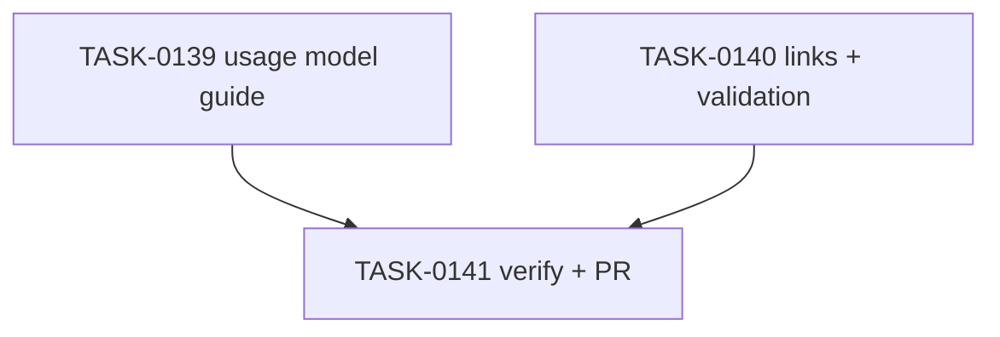

# PLAN-0038: Usage model documentation

## メタデータ

| フィールド | 内容 |
|-----------|------|
| PLAN-ID   | PLAN-0038 |
| SPEC-ID   | SPEC-0038 |
| ステータス | Completed |
| 作成日    | 2026-05-18 |
| 担当Agent | Planning Agent |

## 変更レイヤ

- [ ] controller
- [ ] usecase
- [ ] domain
- [ ] infrastructure
- [ ] frontend
- [x] infra
- [x] test
- [x] docs

## 影響範囲

- Docs: README / README-ja / roadmap / usage model guide
- Validation: Makefile structural guard
- SAGE: SPEC / PLAN / TASK status and scoring

## 実装方針

新規 `docs/usage-model.md` に 5 loops を説明し、README / README-ja から導線を追加する。後続の security split、reviewability gate、Playwright stabilization、React Doctor profile correction は future tracks として扱い、本 PR では実装済みと表現しない。

## タスク分解

| TASK-ID | 責務 | 担当Agent | 見積 | 依存TASK | 並列可否 |
|---------|------|----------|------|---------|---------|
| TASK-0139 | usage model guide | Docs | 25m | none | Yes |
| TASK-0140 | public links and validation guard | Validation | 20m | TASK-0139 | Yes |
| TASK-0141 | AC 検証、採点、SAGE status 更新、commit / PR | Verify | 25m | TASK-0139, TASK-0140 | No |

## 依存グラフ

## File Scope by Task

| TASK-ID | 変更許可ファイル |
|---|---|
| TASK-0139 | `docs/usage-model.md` |
| TASK-0140 | `README.md`, `README-ja.md`, `docs/roadmap.md`, `Makefile` |
| TASK-0141 | `specs/SPEC-0038-usage-model-docs.md`, `plans/PLAN-0038-usage-model-docs.md`, `tasks/TASK-0139-usage-model-doc.md`, `tasks/TASK-0140-usage-model-doc-links-validation.md`, `tasks/TASK-0141-verify-usage-model-docs.md` |

## 必要な検証

- [x] docs grep: usage model has Local loop / Repair loop / E2E loop / CI gate / Review gate
- [x] link grep: README / README-ja / roadmap link `docs/usage-model.md`
- [x] validation: `make validate-structure`
- [x] repo validation: `node --test tests/cli/*.test.mjs`, `make validate`, `bash scripts/sage-validate.sh`, `git diff --check`
- [x] security scan: secret / token / private URL grep
- [x] architecture boundary check: File Scope / protected file / local-only memo untracked

## Error Resolution

| 失敗 | 復旧手順 |
|---|---|
| usage model too abstract | Add concrete "when to use" and command examples |
| docs overclaim follow-up tracks | Change wording to future / planned |
| Makefile false positive | Narrow checks to exact docs files and phrases |
| local memo appears in status | Ensure `.local/` remains ignored and do not stage |

## Knowledge Management

usage model confusion が発生した場合、maintainer が confusing phrase, expected wording, affected doc を `sage/failures.md` に記録する。同じ confusion が 3 回累積した場合、`sage/anti-patterns.md` への昇格候補にする。

## 採点

- SPEC-0038: 100/S++（6軸: Codified Rules 20 / Atomic Decomposition 20 / Spec-Driven 20 / Observable 20 / Knowledge 15 / Gradual Adoption 5）
- PLAN-0038: 100/S++（6軸: Codified Rules 20 / Atomic Decomposition 20 / Spec-Driven 20 / Observable 20 / Knowledge 15 / Gradual Adoption 5）
- TASK-0139: 100/S++
- TASK-0140: 100/S++
- TASK-0141: 100/S++
