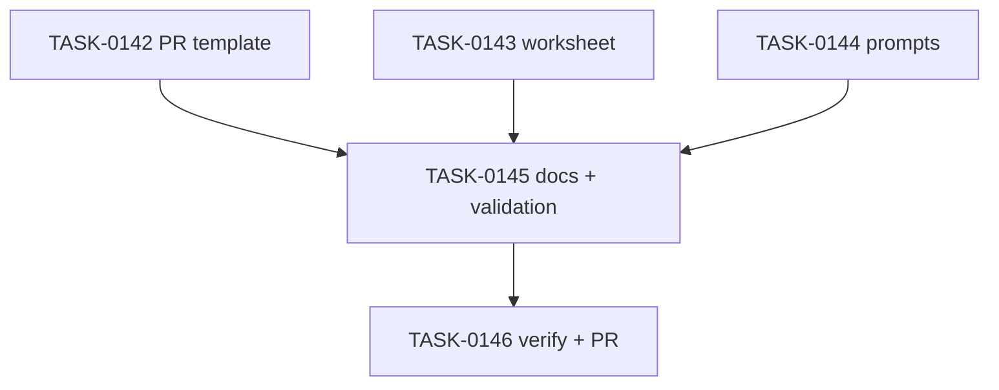

# PLAN-0039: Reviewability gate templates

## メタデータ

| フィールド | 内容 |
|-----------|------|
| PLAN-ID   | PLAN-0039 |
| SPEC-ID   | SPEC-0039 |
| ステータス | Completed |
| 作成日    | 2026-05-18 |
| 担当Agent | Planning Agent |

## 変更レイヤ

- [ ] controller
- [ ] usecase
- [ ] domain
- [ ] infrastructure
- [ ] frontend
- [x] infra
- [x] test
- [x] docs

## 影響範囲

- Package templates: manual-copy PR template, worksheet, and prompt library
- Docs: package template catalog, usage model, README / README-ja, roadmap
- Validation: Makefile structural guard
- SAGE: SPEC / PLAN / TASK status and scoring

## 実装方針

Review gate を runtime や CLI から切り離し、まず配布可能なドキュメントテンプレートとして追加する。PR template は導入先 repository にコピーされる想定の英語 primary とし、root repository の PR template は変更しない。Prompt library は既存の plan-first / diagnostic-repair と同じ思想に接続し、AI が生成したコードを人間が説明できる状態にする補助として設計する。

## タスク分解

| TASK-ID | 責務 | 担当Agent | 見積 | 依存TASK | 並列可否 |
|---------|------|----------|------|---------|---------|
| TASK-0142 | package template PR template | Docs | 20m | none | Yes |
| TASK-0143 | AI code understanding worksheet | Docs | 20m | none | Yes |
| TASK-0144 | four reviewability prompts | Docs | 35m | none | Yes |
| TASK-0145 | catalog docs and validation guards | Validation | 30m | TASK-0142, TASK-0143, TASK-0144 | No |
| TASK-0146 | AC 検証、採点、SAGE status 更新、commit / PR | Verify | 30m | TASK-0142, TASK-0143, TASK-0144, TASK-0145 | No |

## 依存グラフ

## File Scope by Task

| TASK-ID | 変更許可ファイル |
|---|---|
| TASK-0142 | `package-templates/.github/PULL_REQUEST_TEMPLATE.md` |
| TASK-0143 | `package-templates/worksheet/ai-code-understanding.md` |
| TASK-0144 | `package-templates/prompts/design-explanation.md`, `package-templates/prompts/tradeoff-analysis.md`, `package-templates/prompts/self-understanding-check.md`, `package-templates/prompts/review-training.md` |
| TASK-0145 | `package-templates/README.md`, `package-templates/prompts/README.md`, `docs/usage-model.md`, `README.md`, `README-ja.md`, `docs/roadmap.md`, `Makefile` |
| TASK-0146 | `specs/SPEC-0039-reviewability-gate-templates.md`, `plans/PLAN-0039-reviewability-gate-templates.md`, `tasks/TASK-0142-reviewability-pr-template.md`, `tasks/TASK-0143-reviewability-worksheet.md`, `tasks/TASK-0144-reviewability-prompts.md`, `tasks/TASK-0145-reviewability-docs-validation.md`, `tasks/TASK-0146-verify-reviewability-gate.md` |

## 必要な検証

- [x] docs grep: PR template has AI-Generated Code Review, Adopted design, Alternatives considered, Risks and tradeoffs, Tests added or updated
- [x] docs grep: worksheet has AI Request, Adopted Design, Alternatives Considered, Fragile Areas, Reimplementation Check
- [x] docs grep: four prompt files have Purpose, Prompt, Usage, Review Output
- [x] link grep: package README, prompts README, README / README-ja, usage model, roadmap link reviewability templates
- [x] validation: `make validate-structure`
- [x] repo validation: `node --test tests/cli/*.test.mjs`, `make validate`, `bash scripts/sage-validate.sh`, `git diff --check`
- [x] security scan: secret / token / private URL grep
- [x] architecture boundary check: File Scope / protected file / local-only memo untracked

## リスク

- リスク1: Template wording becomes too verbose for daily PR use → keep required fields short and put deeper reflection in worksheet
- リスク2: Prompt library duplicates diagnostic-repair responsibilities → position new prompts as review / explanation prompts, not repair prompts
- リスク3: Validation false positives on common words like token → narrow checks to changed files and exclude explanatory headings if needed

## Error Resolution

| 失敗 | 復旧手順 |
|---|---|
| PR template lacks required review evidence | Add missing headings under AI-Generated Code Review |
| Worksheet is too abstract | Add concrete fields and yes/no checks |
| Prompt file does not match catalog | Add required section headings and README entry |
| Docs overclaim CLI behavior | Change wording to manual-copy templates or follow-up |
| Makefile false positive | Narrow checks to exact files and headings |
| local memo appears in status | Ensure `.local/` remains ignored and do not stage |

## Knowledge Management

Review gate confusion が発生した場合、maintainer が confusing phrase, expected wording, affected template を `sage/failures.md` に記録する。同じ confusion が 3 回累積した場合、CLI auto-copy や PR template fatigue の follow-up SPEC に昇格する。

## 採点

- SPEC-0039: 100/S++（6軸: Codified Rules 20 / Atomic Decomposition 20 / Spec-Driven 20 / Observable 20 / Knowledge 15 / Gradual Adoption 5）
- PLAN-0039: 100/S++（6軸: Codified Rules 20 / Atomic Decomposition 20 / Spec-Driven 20 / Observable 20 / Knowledge 15 / Gradual Adoption 5）
