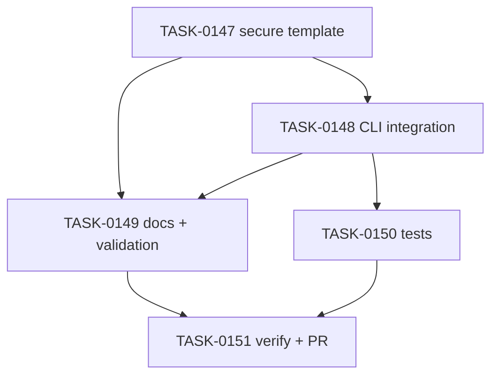

# PLAN-0040: Security split check

## メタデータ

| フィールド | 内容 |
|-----------|------|
| PLAN-ID   | PLAN-0040 |
| SPEC-ID   | SPEC-0040 |
| ステータス | Completed |
| 作成日    | 2026-05-18 |
| 担当Agent | Planning Agent |

## 変更レイヤ

- [ ] controller
- [ ] usecase
- [ ] domain
- [x] infrastructure
- [ ] frontend
- [x] infra
- [x] test
- [x] docs

## 影響範囲

- Package templates: package script fragment and shell script entry points
- CLI: profile script generation, script file copy/check/update, diagnostics
- Tests: init / doctor / update / package smoke tests
- Docs: package templates, profile READMEs, CLI, usage model, README / roadmap
- Validation: Makefile structural guard
- SAGE: SPEC / PLAN / TASK status and scoring

## 実装方針

`ai:check` は既存の機能品質 command のまま維持し、`ai:check:secure` を独立した Semgrep command として追加する。CLI は expected profile scripts と copied shell scripts に secure variant を加える。GitHub Actions workflow は変更せず、既存 hosted workflow / Composite Action の `check-command` に `pnpm ai:check:secure` を渡せることだけを docs に示す。

## タスク分解

| TASK-ID | 責務 | 担当Agent | 見積 | 依存TASK | 並列可否 |
|---------|------|----------|------|---------|---------|
| TASK-0147 | secure package script and shell template | Implementation | 25m | none | Yes |
| TASK-0148 | CLI profile / init / doctor / update integration | Implementation | 35m | TASK-0147 | No |
| TASK-0149 | docs and structural validation | Docs | 35m | TASK-0147, TASK-0148 | No |
| TASK-0150 | CLI and package tests | Test | 35m | TASK-0148 | No |
| TASK-0151 | AC 検証、採点、SAGE status 更新、commit / PR | Verify | 30m | TASK-0147, TASK-0148, TASK-0149, TASK-0150 | No |

## 依存グラフ

## File Scope by Task

| TASK-ID | 変更許可ファイル |
|---|---|
| TASK-0147 | `package-templates/package.scripts.fragment.json`, `package-templates/scripts/ai-check-secure.sh`, `package-templates/scripts/README.md` |
| TASK-0148 | `src/cli/profile-scripts.mjs`, `src/cli/profile-diagnostics.mjs`, `src/cli/init.mjs`, `src/cli/doctor.mjs`, `src/cli/update.mjs` |
| TASK-0149 | `package-templates/README.md`, `package-templates/profiles/README.md`, `package-templates/profiles/react-nextjs/README.md`, `package-templates/profiles/react-vanilla/README.md`, `package-templates/profiles/expo-rn/README.md`, `package-templates/profiles/node-cli/README.md`, `package-templates/profiles/supabase-rls/README.md`, `docs/cli.md`, `docs/usage-model.md`, `README.md`, `README-ja.md`, `docs/roadmap.md`, `Makefile` |
| TASK-0150 | `tests/cli/init.test.mjs`, `tests/cli/doctor.test.mjs`, `tests/cli/update.test.mjs`, `tests/cli/package.test.mjs` |
| TASK-0151 | `specs/SPEC-0040-security-split-check.md`, `plans/PLAN-0040-security-split-check.md`, `tasks/TASK-0147-security-script-template.md`, `tasks/TASK-0148-security-cli-integration.md`, `tasks/TASK-0149-security-docs-validation.md`, `tasks/TASK-0150-security-tests.md`, `tasks/TASK-0151-verify-security-split.md` |

## 必要な検証

- [x] `bash -n package-templates/scripts/ai-check-secure.sh`
- [x] docs grep: `ai:check:secure`, `semgrep scan --config auto`, separation from `ai:check`
- [x] CLI tests: `node --test tests/cli/*.test.mjs`
- [x] validation: `make validate-structure`
- [x] repo validation: `make validate`, `bash scripts/sage-validate.sh`, `git diff --check`
- [x] security scan: secret / private URL grep
- [x] architecture boundary check: File Scope / protected file check

## リスク

- リスク1: Existing users see doctor drift after upgrading → update can create secure script and package script
- リスク2: Semgrep unavailable in target project → docs keep install responsibility explicit and do not add npm dependency
- リスク3: Tests overfit exact script order → only expected profile scripts should assert exact commands

## Error Resolution

| 失敗 | 復旧手順 |
|---|---|
| secure script not copied | Add file name to init/update/doctor script loops |
| doctor fails healthy fixture | Update expected profile scripts and test fixture assertions consistently |
| docs overclaim security coverage | Reword as deterministic scan gate, not full security assurance |
| Makefile false positive | Narrow checks to exact file paths and phrases |

## Knowledge Management

Semgrep 導入責務や false positive の混乱が起きた場合、maintainer が command, expected, actual, affected docs を `sage/failures.md` に記録する。Hosted security job template が必要になった場合は future SPEC に昇格する。

## 採点

- SPEC-0040: 100/S++（6軸: Codified Rules 20 / Atomic Decomposition 20 / Spec-Driven 20 / Observable 20 / Knowledge 15 / Gradual Adoption 5）
- PLAN-0040: 100/S++（6軸: Codified Rules 20 / Atomic Decomposition 20 / Spec-Driven 20 / Observable 20 / Knowledge 15 / Gradual Adoption 5）
