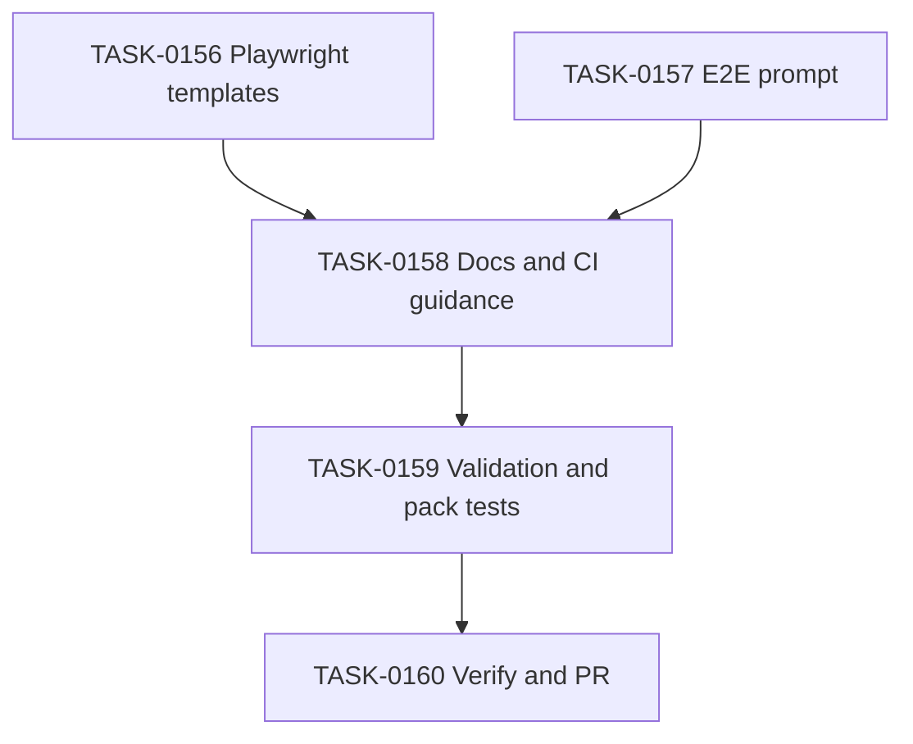

# PLAN-0042: Playwright Stabilization Templates

## メタデータ

| フィールド | 内容 |
|-----------|------|
| PLAN-ID   | PLAN-0042 |
| SPEC-ID   | SPEC-0042 |
| ステータス | Completed |
| 作成日    | 2026-05-18 |
| 担当Agent | Planning Agent |

## 変更レイヤ

- [ ] controller
- [ ] usecase
- [ ] domain
- [ ] infrastructure
- [ ] frontend
- [x] infra
- [x] test
- [x] docs
- [x] package-template

## 影響範囲

- `package-templates/playwright/`: manual-copy Playwright config / smoke test / README
- `package-templates/prompts/`: E2E test creation prompt and catalog update
- `package-templates/ci-examples/`: artifact upload and Playwright CI guidance
- `package-templates/profiles/react-nextjs/README.md`: React Next.js profile guidance
- `docs/usage-model.md`: E2E loop explanation
- `tests/cli/package.test.mjs` and `Makefile`: pack / structure validation
- SAGE artifacts for traceability

## 実装方針

1. CLI 自動コピーは行わず、manual-copy template として `package-templates/playwright/` を追加する。
2. `playwright.config.ts` は Next.js / React の一般形に寄せ、`baseURL`、`webServer`、trace、reporter、retry、artifact output を含める。
3. smoke spec は `@smoke` grep、`getByRole`、短い assertion、実アプリ依存を避けたコメントを中心にする。
4. E2E prompt は自然言語仕様から Playwright test へ変換するが、AC を変えない、CSS / XPath 乱用禁止、trace を証跡として使う、という制約を入れる。
5. CI example は既存 workflow を壊さず、Playwright browser install と artifact upload を copy example として追加する。
6. validation は存在確認・重要文言・npm pack inclusion を機械化する。

選択肢比較:

| 選択肢 | 採否 | 理由 |
|---|---|---|
| CLI `init` で Playwright config を自動コピー | 不採用 | 認証・port・app command が project-specific で、初期導入時の衝突リスクが高い |
| manual-copy template | 採用 | 汎用性が高く、導入者が必要部分だけ調整できる |
| `.claude/rules/test-rules.md` を更新 | 不採用 | Codex-only boundary により Claude Code-specific file は今回 scope 外 |

## タスク分解

| TASK-ID | 責務 | 担当Agent | 見積 | 依存TASK | 並列可否 |
|---------|------|----------|------|---------|---------|
| TASK-0156 | Playwright manual templates を追加する | Implementation | 45m | none | Yes |
| TASK-0157 | E2E test creation prompt と catalog を追加する | Implementation | 30m | none | Yes |
| TASK-0158 | CI / profile / usage docs に安定化導線を追加する | Implementation | 30m | TASK-0156, TASK-0157 | No |
| TASK-0159 | validation / pack tests を追加する | Test | 30m | TASK-0156, TASK-0157, TASK-0158 | No |
| TASK-0160 | AC 検証・SAGE status 更新・PR 作成を行う | Review | 30m | TASK-0159 | No |

## 依存グラフ



## リスク

- Playwright example が特定 app command に寄りすぎる → `npm run dev` / port は placeholder として調整前提にする
- artifact upload が secret を残す → storageState を template に含めず、trace upload の注意を docs に書く
- CI example が Playwright 未導入プロジェクトで失敗する → browser install step は conditional comment として追加し、実行は project-specific に任せる

## 必要な検証

- [x] unit test: `node --test tests/cli/*.test.mjs`
- [x] integration test: `make validate`
- [x] security scan: secret-like pattern scan
- [x] e2e test: not applicable（template追加のみ。Playwright実行は利用者プロジェクト側）
- [x] architecture boundary check: File Scope check + `bash scripts/sage-validate.sh`

## 自動採点

```yaml
eval_feedback:
  target_file: "plans/PLAN-0042-playwright-stabilization-templates.md"
  target_type: PLAN
  verdict: PASS
  total_score: 100
  grade: "S++"
  subscores:
    codified_rules: "20/20"
    atomic_decomposition: "20/20"
    spec_driven_development: "20/20"
    observable_development: "20/20"
    knowledge_management: "15/15"
    gradual_adoption: "5/5"
  findings: []
  fix_instructions: []
```
