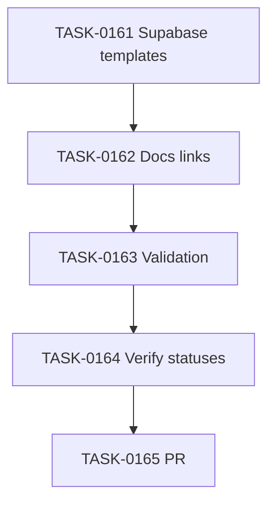

# PLAN-0043: Supabase RLS Testing Templates

## メタデータ

| フィールド | 内容 |
|-----------|------|
| PLAN-ID   | PLAN-0043 |
| SPEC-ID   | SPEC-0043 |
| ステータス | Completed |
| 作成日    | 2026-05-18 |
| 担当Agent | Planning Agent |

## 変更レイヤ

- [ ] controller
- [ ] usecase
- [ ] domain
- [ ] infrastructure
- [ ] frontend
- [ ] infra
- [x] test
- [x] docs
- [x] package-template

## 影響範囲

- `package-templates/supabase/`: RLS testing manual-copy templates
- `package-templates/profiles/supabase-rls/README.md`:導線更新
- `package-templates/prompts/README.md`: prompt / template usage flow の補足
- `Makefile`, `tests/cli/package.test.mjs`: validation / pack inclusion
- SAGE artifacts

## 実装方針

1. Supabase templates は CLI 自動コピーせず、manual-copy として追加する。
2. DB 層は pgTAP SQL template、API 層は Supabase JS + Vitest template、auth E2E は Playwright + local mail capture template に分ける。
3. `service_role` は bypass warning としてのみ記述し、template の client setup では anon key / user session を前提にする。
4. Makefile と pack dry-run test で inclusion と重要文言を検証する。

## タスク分解

| TASK-ID | 責務 | 担当Agent | 見積 | 依存TASK | 並列可否 |
|---------|------|----------|------|---------|---------|
| TASK-0161 | Supabase RLS manual templates を追加する | Implementation | 45m | none | Yes |
| TASK-0162 | profile / prompt docs に Supabase template 導線を追加する | Implementation | 25m | TASK-0161 | No |
| TASK-0163 | validation / pack tests を追加する | Test | 25m | TASK-0161, TASK-0162 | No |
| TASK-0164 | AC 検証と SAGE status 更新を行う | Review | 25m | TASK-0163 | No |
| TASK-0165 | commit / PR / CI / merge を行う | Review | 25m | TASK-0164 | No |

## 依存グラフ



## リスク

- Supabase CLI command drift → official docs URL を README に明記し、version 確認を促す
- Template misuse with privileged client → `service_role` bypass warning を複数箇所に入れる
- Magic Link local mail API drift → endpoint を env var 化する

## 必要な検証

- [x] unit test: `node --test tests/cli/*.test.mjs`
- [x] integration test: `make validate`
- [x] security scan: secret-like pattern scan
- [x] e2e test: not applicable（manual template 追加のみ）
- [x] architecture boundary check: File Scope check + `bash scripts/sage-validate.sh`

## 自動採点

```yaml
eval_feedback:
  target_file: "plans/PLAN-0043-supabase-rls-testing-templates.md"
  target_type: PLAN
  verdict: PASS
  total_score: 100
  grade: "S++"
  subscores:
    codified_rules: "20/20"
    atomic_decomposition: "20/20"
    spec_driven_development: "20/20"
    observable_development: "20/20"
    knowledge_management: "15/15"
    gradual_adoption: "5/5"
  findings: []
  fix_instructions: []
```
